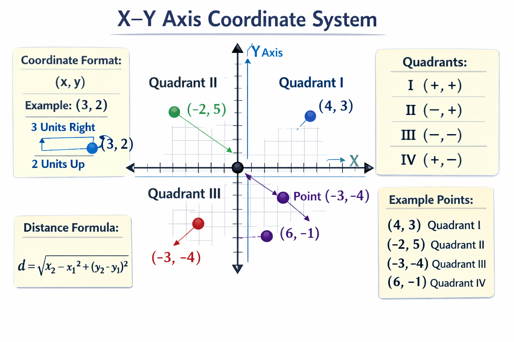
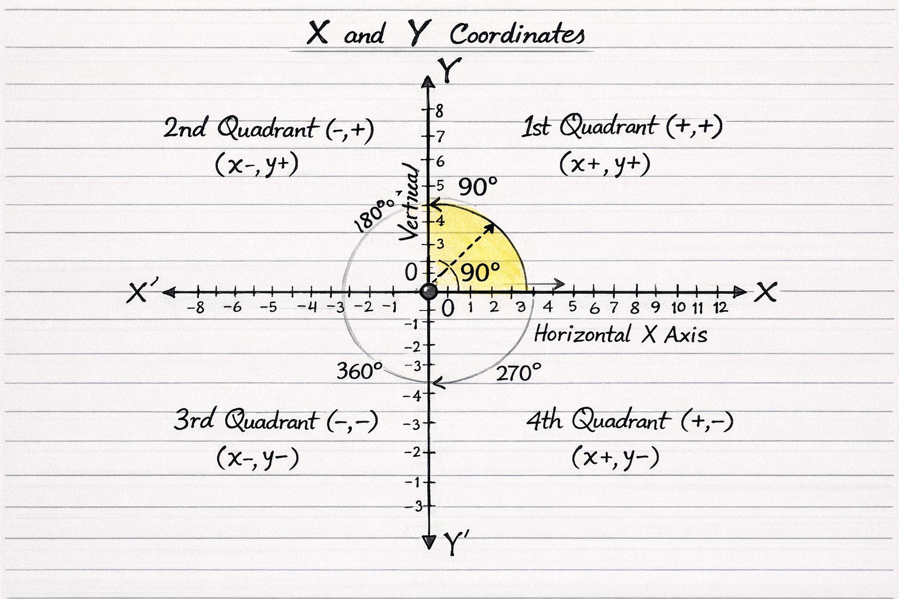
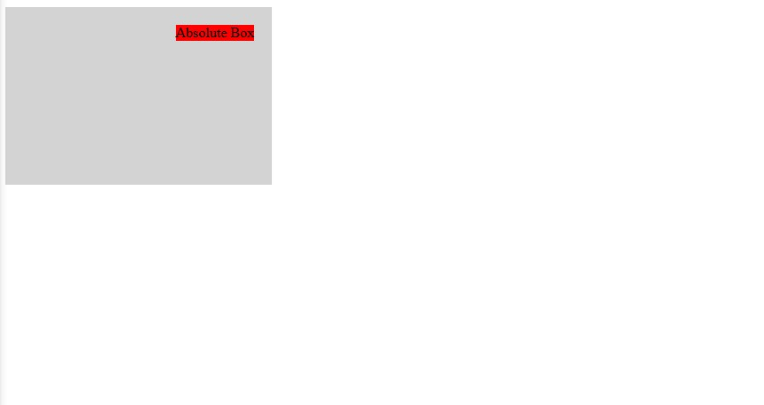
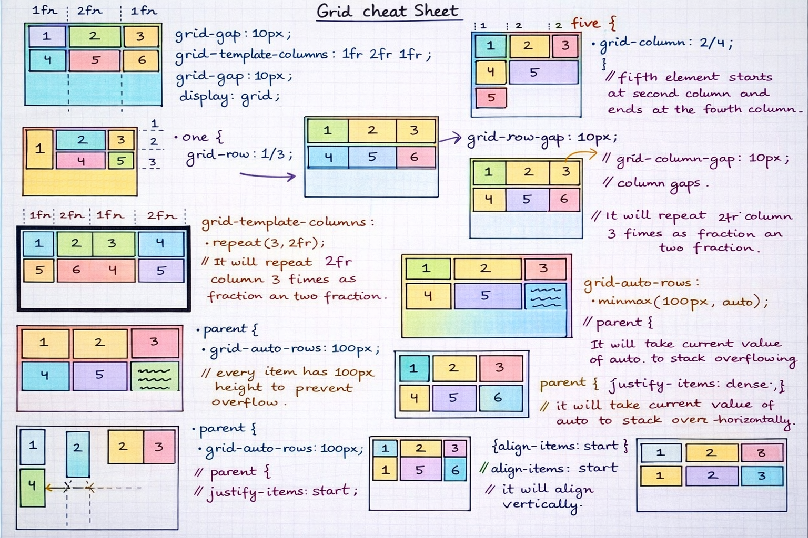

# 📝 Hands-on CSS3 Notes

A concise collection of self-made CSS3 notes, code snippets, and best practices.

Maintained by [Md. Shah Alam Iqbal](https://github.com/msa-iqbal) as part of the [T-Insights](https://github.com/thetinsights) initiative.

Perfect for learners and developers who need a quick, practical CSS3 reference and fast lookup guide.

- Covers key CSS3 topics with clear explanations
- Copy-ready code snippets
- Best practices for accessibility & SEO
- Beginner-friendly and continuously updated

---

# Table of Contents

| #   | Topic                                                       | Subtopics                                                                                                                                                                                                                                                                                                                                                                                                                          |
| --- | ----------------------------------------------------------- | ---------------------------------------------------------------------------------------------------------------------------------------------------------------------------------------------------------------------------------------------------------------------------------------------------------------------------------------------------------------------------------------------------------------------------------- |
| 1   | [Introduction](#introduction)                               | What is CSS, History of CSS, CSS Versions, How CSS Works with HTML, Syntax of CSS, Comments in CSS                                                                                                                                                                                                                                                                                                                                 |
| 2   | [Ways to Use CSS](#ways-to-use-css)                         | Inline CSS, Internal CSS, External CSS, Priority Order, `!important`                                                                                                                                                                                                                                                                                                                                                               |
| 3   | [X and Y Axis Coordinator](#x-and-y-axis-coordinator)       | Axes, Coordinate Format, Quadrants, Important Formula                                                                                                                                                                                                                                                                                                                                                                              |
| 4   | [CSS Selectors](#css-selectors)                             | Universal Selector, Class Selector, ID Selector, Group Selector, Descendant Selector, Child Selector, Adjacent Sibling Selector, General Sibling Selector, Attribute Selector, Pseudo-class, Pseudo-element                                                                                                                                                                                                                        |
| 5   | [CSS Specificity and Cascade](#css-specificity-and-cascade) | What is Cascade, Specificity Rules, Importance (`!important`), Inheritance, How Conflicts are Resolved                                                                                                                                                                                                                                                                                                                             |
| 6   | [CSS Values and Units](#css-values-and-units)               | Absolute Units, Relative Units, `calc()` Function, Absolute vs Relative Units, CSS Units Table, CSS Units Measurement Table                                                                                                                                                                                                                                                                                                        |
| 7   | [Colors in CSS](#colors-in-css)                             | Color Names, HEX Colors, RGB & RGBA, HSL & HSLA, `opacity`, Gradients                                                                                                                                                                                                                                                                                                                                                              |
| 8   | [CSS Box Model](#css-box-model)                             | Content, `padding`, `border`, Border vs Outline, `margin`, `box-sizing`, `box-shadow`, Border vs Outline                                                                                                                                                                                                                                                                                                                           |
| 9   | [Display and Visibility](#display-and-visibility)           | `display`, `visibility`, `overflow`                                                                                                                                                                                                                                                                                                                                                                                                |
| 10  | [Typography (Text and Fonts)](#typography-text-and-fonts)   | `font-family`, `font-size`, `font-weight`, `font-style`, `line-height`, `letter-spacing`, `word-spacing`, `text-align`, `text-transform`, `text-decoration`, `text-shadow`, `font-variant`, `font-stretch`, `font-kerning`, `text-overflow`, `white-space`, `overflow-wrap`, `word-break`, `writing-mode`, `direction`, `vertical-align`, `text-indent`, `text-justify`, `tab-size`, `text-orientation`, `hyphens`, `Google Fonts` |
| 11  | [CSS Backgrounds](#css-backgrounds)                         | `background-color`, `background-image`, `background-repeat`, `background-position`, `background-size`, `background-attachment`, `background-clip`, `background-origin`, `background-blend-mode`                                                                                                                                                                                                                                    |
| 12  | [CSS Positioning](#css-positioning)                         | `static`, `relative`, `absolute`, `fixed`, `sticky`, `z-index`                                                                                                                                                                                                                                                                                                                                                                     |
| 13  | [Float and Clear](#float-and-clear)                         | `float`, `clear`, Clearfix technique, Problems with float                                                                                                                                                                                                                                                                                                                                                                          |
| 14  | [CSS Flexbox](#css-flexbox)                                 | Flexbox Basics, Flex Container, `flex-direction`, `flex-wrap`, `justify-content`, `align-items`, `align-content`, `flex-grow`, `flex-shrink`, `flex-basis`, `order`, Flexbox Cheat Sheet                                                                                                                                                                                                                                           |
| 15  | [CSS Grid](#css-grid)                                       | Grid Basics, `grid-template-columns`, `grid-template-rows`, `gap`, `grid-column`, `grid-row`, `grid-area`, Named Grid Areas, auto-fit vs auto-fill, `minmax()`                                                                                                                                                                                                                                                                     |
| 16  | [Responsive Design](#responsive-design)                     | Viewport, Media Queries, Mobile First Approach, Breakpoints, Fluid Layout, Responsive Images                                                                                                                                                                                                                                                                                                                                       |
|     | [Transitions and Transforms](#transitions-and-transforms)   | `transition-property`, `transition-duration`, `transition-timing-function`, `transition-delay`, `translate`, `scale`, `rotate`, `skew`                                                                                                                                                                                                                                                                                             |
| 17  | [Animations](#animations)                                   | `@keyframes`, `animation-name`, `animation-duration`, `animation-delay`, `animation-iteration-count`, `animation-direction`, `animation-fill-mode`, `animation-timing-function`                                                                                                                                                                                                                                                    |
| 18  | [CSS Functions](#css-functions)                             | `calc()`, `var()`, `clamp()`, `min()`, `max()`                                                                                                                                                                                                                                                                                                                                                                                     |
| 19  | [CSS Variables](#css-variables)                             | Defining Variables, Using Variables, Global vs Local Scope                                                                                                                                                                                                                                                                                                                                                                         |
| 20  | [Advanced Topics](#advanced-topics)                         | `object-fit`, `aspect-ratio`, `filter`, `backdrop-filter`, `mix-blend-mode`, `writing-mode`, `scroll-behavior`                                                                                                                                                                                                                                                                                                                     |
| 21  | [Best Practices](#best-practices)                           | Avoid Inline CSS, Reusable Classes, Performance Tips, Browser Compatibility                                                                                                                                                                                                                                                                                                                                                        |
| 22  | [Debugging and Tools](#debugging-and-tools)                 | Chrome DevTools, Inspect Element, Common CSS Errors, How to Fix Layout Issues,                                                                                                                                                                                                                                                                                                                                                     |
| 23  | [CSS CHEATSHEET](#css-cheatsheet)                           | Layout & Display, Box Model, Background, Positioning, Text & Fonts, Cursor & Interaction, Flexbox, Grid, Transitions & Animation, Effects, Responsive Design, Lists & Tables, Links, Advanced / Misc                                                                                                                                                                                                                               |
| 24  | [APPENDIX](#appendix)                                       | Browser Support Table, Useful Resources, Contribution Guide                                                                                                                                                                                                                                                                                                                                                                        |

# Introduction

## 🗁 What is CSS

**CSS (Cascading Style Sheets)** is a stylesheet language used to control the **appearance and layout** of HTML elements on a web page.

With CSS, you can control: `Colors`, `Fonts`, `Spacing`, `Layout`, `Animations`

🕮 Example:

```css
p {
  color: blue;
  font-size: 18px;
}
```

## 🗁 History of CSS

CSS was created by **Håkon Wium Lie** in **1996**.

Before CSS, styling was done using HTML tags like as `<font>`, `<center>`, `<bgcolor>`

This made code:

- 〔✗〕 messy
- 〔✗〕 hard to maintain
- 〔✗〕 not reusable

CSS solved this by:

- 〔✓〕 Separating content (HTML) from design (CSS)
- 〔✓〕 Making websites easier to manage

## 🗁 CSS Versions (CSS1 → CSS3)

| Version | Year  | Key Features                       |
| ------- | ----- | ---------------------------------- |
| CSS1    | 1996  | Fonts, colors, basic layout        |
| CSS2    | 1998  | Positioning, z-index, media types  |
| CSS2.1  | 2011  | Bug fixes & stability              |
| CSS3    | 2012+ | Animations, flexbox, grid, shadows |

## 🗁 Why CSS3 is special?

CSS3 is divided into **modules**:

- Flexbox
- Grid
- Animation
- Transform
- Media Queries

So, browsers can support features independently.

## 🗁 How CSS Works with HTML

HTML = Structure  
CSS = Style

CSS selects HTML elements and applies styles to them.

🕮 Example:

```html
<p>Hello World</p>
```

```css
p {
  color: red;
}
```

Working Flow:

1. Browser reads HTML
2. Browser reads CSS
3. CSS rules match HTML elements
4. Styles are applied

**Result**: Text appears red

## 🗁 Syntax of CSS

Basic CSS rule format:

```plaintext
selector {
property: value;
}
```

Parts:

- Selector → which element to style
- Property → what to change
- Value → new setting

Example 1: (Single properties)

```css
h1 {
  color: green;
  font-size: 32px;
}
```

Example 2: (Multiple properties)

```css
div {
  width: 200px;
  height: 100px;
  background-color: yellow;
}
```

## 🗁 Comments in CSS

Comments are used to:

- 〔✓〕 explain code
- 〔✓〕 disable code
- 〔✓〕 make CSS readable

**Single-line Comment**:

Used for short explanations in one line.

```css
/* This is a comment */
p {
  color: blue; /* text color */
}
```

**Multi-line Comment**:

Used for longer explanations across multiple lines.

```css
/*
This is a
multi-line
CSS comment
*/

h1 {
  color: red;
  font-size: 32px;
}
```

<!-- START "Jump to Top"-->
<p align="right">
  <a href="#table-of-contents">Jump to Top ▲</a>
</p>
<!-- END "Jump to Top" -->

# Ways to Use CSS

CSS can be applied to HTML in three different ways:

1. Inline CSS
2. Internal CSS
3. External CSS

And when multiple styles exist, CSS follows a priority order (cascade).

## 🗁 Inline CSS

Inline CSS is written directly inside an HTML tag using the style attribute.

Syntax:

```plaintext
<tag style="property: value;">
```

🕮 Example:

```html
<p style="color: red; font-size: 18px;">This is inline CSS</p>
```

- 〔✓〕 Applied only to that element
- 〔✓〕 Highest priority
- 〔✗〕 Not reusable
- 〔✗〕 Hard to maintain

Use case:

- Quick testing
- Small demo
- One-time style

## 🗁 Internal CSS

Internal CSS is written inside the `<style>` tag in the `<head>` section of HTML.

🕮 Example:

```html
<!DOCTYPE html>
<html>
  <head>
    <style>
      p {
        color: blue;
        font-size: 20px;
      }
    </style>
  </head>
  <body>
    <p>This is internal CSS</p>
  </body>
</html>
```

- 〔✓〕 Affects whole page
- 〔✓〕 Easy for small projects
- 〔✗〕 Not reusable for multiple pages

Use case:

- Single-page website
- Practice projects

## 🗁 External CSS

External CSS is written in a separate `.css` file and linked to HTML.

Step 1: Create CSS file (`style.css`)

```css
body {
  background-color: #f2f2f2;
}

h1 {
  color: green;
}

p {
  font-size: 18px;
}
```

Step 2: Link CSS file in HTML

```html
<!DOCTYPE html>
<html>
  <head>
    <link rel="stylesheet" href="style.css" />
  </head>
  <body>
    <h1>External CSS</h1>
    <p>This is styled using external CSS</p>
  </body>
</html>
```

- 〔✓〕 Best practice
- 〔✓〕 Reusable
- 〔✓〕 Easy to maintain
- 〔✓〕 Cleaner code

Use case:

- Real websites
- Multi-page projects
- Team projects

## 🗁 Priority Order (Cascade)

When multiple CSS rules target the same element, browser decides using priority rules.

Priority order (highest → lowest)

1. 🥇 Inline CSS
2. 🥈 Internal CSS
3. 🥉 External CSS

🕮 Example:

```html
<!DOCTYPE html>
<html>
  <head>
    <style>
      p {
        color: blue;
      }
    </style>
  </head>
  <body>
    <p style="color: red;">Hello CSS</p>
  </body>
</html>
```

What will be the color?

⇒ Red (because inline CSS has higher priority than internal CSS)

Another 🕮 Example:

```html
<head>
  <link rel="stylesheet" href="style.css" />
  <style>
    p {
      color: green;
    }
  </style>
</head>
```

```css
/* style.css */
p {
  color: blue;
}
```

What will be the color?

⇒ Green (Because, Internal CSS overrides External CSS)

## 🗁 IMPORTANT (`!important`)

`!important` overrides everything (use carefully):

🕮 Example:

```css
p {
  color: red !important;
}
```

- 〔✗〕 Bad for maintainability
- 〔✓〕 Only for special cases

<!-- START "Jump to Top"-->
<p align="right">
  <a href="#table-of-contents">Jump to Top ▲</a>
</p>
<!-- END "Jump to Top" -->

# X and Y Axis Coordinator

An X–Y Axis Coordinate System (also called the Cartesian Coordinate System) is used to locate points on a 2D plane.

## 🗁 Axes

- **X-axis** → Horizontal line
- **Y-axis** → Vertical line
- The point where they meet is called the **Origin (0,0).**

## 🗁 Coordinate Format

A point is written as:

(x, y)

- `x` → distance from origin along the `X-axis`
- `y` → distance from origin along the `Y-axis`

🕮 Example:

(3, 2) → Move **3 units right** on X, then **2 units up** on Y.



## 🗁 Quadrants

The plane is divided into 4 quadrants:

| Quadrant | X Value | Y Value |
| -------- | ------- | ------- |
| I        | +       | +       |
| II       | −       | +       |
| III      | −       | −       |
| IV       | +       | −       |

Visual Graph:

```plaintext
            Y+
            ↑
            |
      II    |     I
            |
X- ←--------0--------→ X+
            |
     III    |     IV
            |
            ↓
            Y-
```

🕮 Example Points:

- (4, 3) → Quadrant I
- (-2, 5) → Quadrant II
- (-3, -4) → Quadrant III
- (6, -1) → Quadrant IV



## 🗁 Important Formula

Distance between two points:

```markdown
d = sqrt((x2 - x1)^2 + (y2 - y1)^2)
```

This calculates the straight-line distance between two coordinates.

<!-- START "Jump to Top"-->
<p align="right">
  <a href="#table-of-contents">Jump to Top ▲</a>
</p>
<!-- END "Jump to Top" -->

# CSS Selectors

CSS selectors are used to select HTML elements and apply styles to them.

Basic Syntax:

```plaintext
selector {
property: value;
}
```

🕮 Example:

```css
p {
  color: red;
  font-size: 16px;
}
```

## 🗁 Universal Selector (`*`)

Selects all elements on the page.

🕮 Example:

```css
* {
  margin: 0;
  padding: 0;
}
```

- 〔✓〕 Commonly used for reset styles
- 〔✗〕 Can affect performance if overused

Selects all elements on the page.

## 🗁 Element Selector

Selects elements by tag name.

🕮 Example:

```css
p {
  color: blue;
}

h1 {
  font-size: 32px;
}
```

Styles all `<p>` and `<h1>` elements

## 🗁 Class Selector (`.`)

Selects elements by class attribute.

🕮 Example:

```css
.box {
  width: 100px;
  height: 100px;
  background: red;
}
```

```html
<div class="box"></div>
```

- 〔✓〕 Reusable
- 〔✓〕 Multiple elements can share same class

## 🗁 ID Selector (`#`)

Selects element by id attribute.

🕮 Example:

```css
# header {
  background: black;
  color: white;
}
```

```html
<div id="header">Header</div>
```

- 〔✓〕 Unique (only one per page)
- 〔✗〕 Not reusable

## 🗁 Group Selector

Apply same style to multiple selectors.

🕮 Example:

```css
h1,
h2,
p {
  color: green;
}
```

- 〔✓〕 Reduces duplicate code

## 🗁 Descendant Selector (space)

Selects elements inside another element (any level).

🕮 Example:

```css
div p {
  color: red;
}
```

```html
<div>
  <p>Styled</p>
</div>
```

⇒ Selects `<p>` inside `<div>`

## 🗁 Child Selector (`>`)

Selects only direct children.

🕮 Example:

```css
div > p {
  color: blue;
}
```

```html
<div>
  <p>Styled</p>
  <section>
    <p>Not styled</p>
  </section>
</div>
```

⇒ More strict than descendant selector

## 🗁 Adjacent Sibling Selector (`+`)

Selects the next element immediately after.

🕮 Example:

```css
h1 + p {
  color: orange;
}
```

```html
<h1>Title</h1>
<p>Styled</p>
<p>Not styled</p>
```

⇒ Only first `<p>` is selected

## 🗁 General Sibling Selector (`~`)

Selects all siblings after the element.

🕮 Example:

```css
h1 ~ p {
  color: purple;
}
```

```html
<h1>Title</h1>
<p>Styled</p>
<p>Styled</p>
```

⇒ All following `<p>` elements are selected

## 🗁 Attribute Selectors

### ၊၊||၊ `[attr]` → Has attribute

```css
input[disabled] {
  background: gray;
}
```

### ၊၊||၊ `[attr=value]` → Exact match

```css
input[type="password"] {
  border: 2px solid red;
}
```

### ၊၊||၊ `[attr^=value]` → Starts with

```css
a[href^="https"] {
  color: green;
}
```

### ၊၊||၊ `[attr$=value]` → Ends with

```css
a[href$=".pdf"] {
  color: red;
}
```

### ၊၊||၊ `[attr*=value]` → Contains

```css
img[src*="icon"] {
  width: 50px;
}
```

## 🗁 Pseudo-Class Selectors

Used to style elements in a special state.

### ၊၊||၊ `:hover`

```css
button:hover {
  background: blue;
  color: white;
}
```

### ၊၊||၊ `:focus`

```css
input:focus {
  border-color: green;
}
```

### ၊၊||၊ `:active`

```css
a:active {
  color: red;
}
```

### ၊၊||၊ `:first-child`

```css
li:first-child {
  color: blue;
}
```

### ၊၊||၊ `:last-child`

```css
li:last-child {
  color: red;
}
```

### ၊၊||၊ `:nth-child(n)`

```css
li:nth-child(2) {
  color: orange;
}

li:nth-child(even) {
  background: #eee;
}
```

## 🗁 Pseudo-Element Selectors

Used to style specific parts of elements.

### ၊၊||၊ `::before`

```css
p::before {
  content: "👉 ";
}
```

### ၊၊||၊ `::after`

```css
p::after {
  content: " - 〔✓〕";
}
```

### ၊၊||၊ `::first-letter`

```css
p::first-letter {
  font-size: 30px;
  color: red;
}
```

### ၊၊||၊ `::first-line`

🕮 Example:

```css
p::first-line {
  font-weight: bold;
}
```

```html
<p>
  CSS is a powerful styling language used to design web pages. It allows
  developers to control layout, colors, fonts, and animations with simple rules.
</p>
```

Explanation:

Only the first line of the paragraph will be bold.

## ☰ Final Thoughts

- 〔✓〕 Prefer class selectors
- 〔✓〕 Avoid overusing ID selectors
- 〔✓〕 Keep selectors simple
- 〔✓〕 Use pseudo-classes for interaction
- 〔✓〕 Use pseudo-elements for decoration

<!-- START "Jump to Top"-->
<p align="right">
  <a href="#table-of-contents">Jump to Top ▲</a>
</p>
<!-- END "Jump to Top" -->

# CSS Specificity and Cascade

When multiple CSS rules target the same element, the browser must decide which style to apply.

This decision is based on:

- Cascade
- Specificity
- `!important`
- Inheritance
- Source order

## 🗁 Cascade

The browser chooses the final style based on rules and priority order.

Priority (highest → lowest):

1. Inline CSS
2. Internal CSS
3. External CSS
4. Browser default

🕮 Example:

```html
<style>
  p {
    color: blue;
  }
</style>

<p style="color: red;">Hello</p>
```

When multiple CSS rules target the same element, browser decides using priority rules.

Priority order (highest → lowest)

1. 🥇 Inline CSS
2. 🥈 Internal CSS
3. 🥉 External CSS

🕮 Example:

```html
<!DOCTYPE html>
<html>
  <head>
    <style>
      p {
        color: blue;
      }
    </style>
  </head>
  <body>
    <p style="color: red;">Hello CSS</p>
  </body>
</html>
```

What will be the color?

⇒ Red (because inline CSS has higher priority than internal CSS)

Another 🕮 Example:

```html
<head>
  <link rel="stylesheet" href="style.css" />
  <style>
    p {
      color: green;
    }
  </style>
</head>
```

```css
/* style.css */
p {
  color: blue;
}
```

What will be the color?

⇒ Green (Because, Internal CSS overrides External CSS)

## 🗁 Specificity Rules

Specificity decides which selector is stronger.

Specificity order (strongest → weakest):

Example 1:

```css
p {
  /* specificity = 1 */
  color: blue;
}

.text {
  /* specificity = 10*/
  color: green;
}

# title {
  /*specificity = 100*/
  color: red;
}
```

```html
<p id="title" class="text">Hello</p>
```

What will be the color?

⇒ Red (`#title` wins)

Example 2:

```css
div p {
  /*1 + 1 = 2 */
  color: blue;
}

.container p {
  /* 10 + 1 = 11*/
  color: red;
}
```

```html
<div class="container">
  <p>Hello</p>
</div>
```

What will be the color?

⇒ Red (higher specificity)

## 🗁 IMPORTANT (!important)

`!important` overrides all normal rules.

```css
p {
  color: blue !important;
}

# para {
  color: red;
}
```

```html
<p id="para">Text</p>
```

What will be the color?

⇒ Blue (because of `!important`)

> [!NOTE]
> Use only when necessary (e.g. overriding third-party CSS)

## 🗁 Inheritance

Some CSS properties are passed from **parent → child**.

- 〔✓〕 Inherited properties: `color`, `font-family`, `font-size`, `line-height`

- 〔✗〕 Not inherited: `margin`, `padding`, `border`, `background`

🕮 Example:

```css
div {
  color: blue;
  font-family: Arial;
}
```

```html
<div>
  <p>Hello</p>
</div>
```

💡 `<p>` will be blue and Arial (inherited)

**❏❏❏ Stop Inheritance**:

```css
p {
  color: initial;
}
```

Or,

```css
p {
  color: inherit;
}
```

## 🗁 How Conflicts are Resolved

When two or more rules conflict, browser follows this order:

### ၊၊||၊ `!important`

```css
p {
  color: red !important;
}

p {
  color: blue;
}
```

⇒ Red wins

### ၊၊||၊ Specificity

```css
# box {
  color: green;
}

.box {
  color: blue;
}
```

⇒ Green wins (`#box` is stronger)

### ၊၊||၊ Source order (last rule wins)

```css
p {
  color: red;
}

p {
  color: blue;
}
```

⇒ Blue wins (written last)

### ၊၊||၊ Inheritance vs Direct Style

```css
div {
  color: green;
}

p {
  color: red;
}
```

⇒ `p` gets red (direct style beats inherited)

🕮 Real Life Conflict Example

```css
# main p {
  color: blue;
}

.text {
  color: red;
}

p {
  color: green;
}
```

```html
<div id="main">
  <p class="text">Hello</p>
</div>
```

Specificity:

- `#main p` → 100 + 1 = 101
- `.text` → 10
- `p` → 1

⇒ Final color = blue

<!-- START "Jump to Top"-->
<p align="right">
  <a href="#table-of-contents">Jump to Top ▲</a>
</p>
<!-- END "Jump to Top" -->

# CSS Values and Units

In CSS, every property needs a value, and many values use units to define size, spacing, or position.

🕮 Example:

```css
p {
  font-size: 16px;
}
```

Here:

- **font-size** → property
- **16px** → value + unit

## 🗁 Absolute Units

Absolute units are fixed and do not depend on screen or parent size.

### ၊၊||၊ `px` (pixels)

Most common unit in CSS.

```css
.box {
  width: 200px;
  height: 100px;
  background: lightblue;
}
```

- 〔✓〕 Precise
- 〔✓〕 Easy to control
- 〔✗〕 Not flexible for responsive design

### ၊၊||၊ `cm` (centimeter)

Used mostly for print styles.

```css
.print {
  width: 5cm;
}
```

- 〔✗〕 Not reliable on screens
- 〔✓〕 Useful for printing layouts

### ၊၊||၊ `mm` (millimeter)

Also used for print.

```css
.label {
  height: 10mm;
}
```

- 〔✓〕 For physical measurements
- 〔✗〕 Rarely used for web layouts

## 🗁 Relative Units

Relative units depend on:

```plaintext
➜ parent size ➜ root size ➜ viewport size
```

These are best for responsive design.

### ၊၊||၊ `%` (percentage)

Relative to parent element.

```css
.container {
  width: 400px;
}

.box {
  width: 50%;
  background: orange;
}
```

```html
<div class="container">
  <div class="box">50%</div>
</div>
```

⇒ Box width = 200px (50% of parent)

### ၊၊||၊ `em`

Relative to parent **font-size**.

```css
.parent {
  font-size: 20px;
}

.child {
  font-size: 1.5em;
}
```

⇒ Child `font-size` = 30px (20 × 1.5)

💡 Can stack (multiply) in nested elements.

### ၊၊||၊ `rem`

Relative to root (html) font-size.

```css
html {
  font-size: 16px;
}

p {
  font-size: 2rem;
}
```

⇒ Paragraph `font-size` = 32px

- 〔✓〕 Predictable
- 〔✓〕 Best for typography

### ၊၊||၊ `vw` (viewport width)

1vw = 1% of browser width.

```css
.hero {
  width: 100vw;
}
```

⇒ If screen = 1000px → width = 1000px

### ၊၊||၊ `vh` (viewport height)

1vh = 1% of browser height.

```css
.full {
  height: 100vh;
}
```

⇒ Full screen height section

### ☰ CSS Viewport Units (`vw` & `vh`) Calculation

- `vw` = percentage of viewport width
- `vh` = percentage of viewport height

Formula:

```plaintext
value in px = (viewport size × unit value) / 100
```

**❏❏❏ Assumptions**

- 1rem = 16px
- Parent font-size = 16px
- Viewport width (`vw`) = 1000px
- Viewport height (`vh`)= 800px

**❏❏❏ Explanation**

Viewport Width Calculation (vw)

Let, viewport width = 1000px

- `1vw = (1000 × 1) / 100 = 10px`
- `10vw = (1000 × 10) / 100 = 100px`
- `50vw = (1000 × 50) / 100 = 500px`

Viewport Height Calculation (vh)

Let, viewport height = 800px

- `1vh = (800 × 1) / 100 = 8px`
- `10vh = (800 × 10) / 100 = 80px`
- `50vh = (800 × 50) / 100 = 400px`

### ၊၊||၊ `calc()` Function

`calc()` lets you mix units and do math.

Syntax:

```plaintext
property: calc(value1 operator value2);
```

Operators:

- `+` → add
- `-` → subtract
- `*` → multiply
- `/` → divide

Example 1: Width with fixed margin

```css
.box {
  width: calc(100% - 50px);
}
```

⇒ Box = full width minus 50px

Example 2: Font size

```css
p {
  font-size: calc(1rem + 5px);
}
```

⇒ Combines relative + absolute unit

Example 3: Center layout

```css
.container {
  width: calc(100vw - 200px);
}
```

⇒ Responsive width with fixed space

## 🗁 Absolute vs Relative Units

- Absolute: fixed size → `px`
- Relative: depends on parent, root, or viewport → `%`, `em`, `rem`, `vw`, `vh`

## 🗁 CSS Units Measurement Table

### ၊၊||၊ Absolute Units (Fixed size)

| Unit | Meaning          | Example            | Conversion / Notes |
| ---- | ---------------- | ------------------ | ------------------ |
| `px` | Pixels           | `width: 200px;`    | 1px = 1px          |
| `pt` | Points (1/72 in) | `font-size: 12pt;` | 1pt ≈ 1.333px      |
| `pc` | Picas (12pt)     | `1pc = 16px`       | 1pc = 16px         |
| `in` | Inches           | `1in = 96px`       | 1in = 96px         |
| `cm` | Centimeters      | `1cm ≈ 37.8px`     | 1cm = 96px / 2.54  |
| `mm` | Millimeters      | `1mm ≈ 3.78px`     | 1mm = 1/10 cm      |

### ၊၊||၊ Relative Units (Responsive & flexible)

Based on font size / parent

| Unit  | Based On         | Example              | Conversion (assume parent 16px, root 16px) |
| ----- | ---------------- | -------------------- | ------------------------------------------ |
| `%`   | Parent size      | `width: 50%;`        | 50% of 200px = 100px                       |
| `em`  | Parent font-size | `padding: 2em;`      | 2em × 16px = 32px                          |
| `rem` | Root font-size   | `font-size: 1.5rem;` | 1.5rem × 16px = 24px                       |
| `ch`  | Width of "0"     | `width: 60ch;`       | ~60 × 8px = 480px (font dependent)         |
| `ex`  | x-height of font | —                    | ~0.5em = 8px                               |

### ၊၊||၊ Viewport Units (Responsive design)

| Unit   | Meaning            | Example             | Conversion (viewport 1000×800px) |
| ------ | ------------------ | ------------------- | -------------------------------- |
| `vw`   | 1% viewport width  | `width: 50vw;`      | 1vw = 10px → 50vw = 500px        |
| `vh`   | 1% viewport height | `height: 100vh;`    | 1vh = 8px → 100vh = 800px        |
| `vmin` | Smaller of vw/vh   | `font-size: 5vmin;` | 1vmin = 8px → 5vmin = 40px       |
| `vmax` | Larger of vw/vh    | `font-size: 5vmax;` | 1vmax = 10px → 5vmax = 50px      |

### ၊၊||၊ Modern Dynamic Viewport Units (Better mobile handling)

| Unit  | Description              | Conversion (example) |
| ----- | ------------------------ | -------------------- |
| `dvw` | Dynamic viewport width   | 1dvw = 10px          |
| `dvh` | Dynamic viewport height  | 1dvh = 8px           |
| `lvw` | Largest viewport width   | 1lvw = 10px          |
| `lvh` | Largest viewport height  | 1lvh = 8px           |
| `svw` | Smallest viewport width  | 1svw = 10px          |
| `svh` | Smallest viewport height | 1svh = 8px           |

### ၊၊||၊ Font-relative & Advanced Units

| Unit   | Meaning                | Conversion (example) |
| ------ | ---------------------- | -------------------- |
| `1em`  | Current font-size      | 16px (parent)        |
| `1rem` | Root font-size         | 16px (root)          |
| `lh`   | Line height of element | ~16–24px (depends)   |
| `rlh`  | Root line height       | 16px (root)          |
| `cap`  | Capital letter height  | ~8–10px              |
| `ic`   | CJK character width    | ~16px                |

## ☰ Quick Recap

- 〔✓〕 Use `rem` for fonts
- 〔✓〕 Use `%`, `vw`, `vh` for layout
- 〔✓〕 Avoid `cm`, `mm` for web
- 〔✓〕 Use `px` for borders
- 〔✓〕 Use `calc()` for flexible layouts

## ☰ Conclusion

- Absolute units = fixed
- Relative units = flexible
- `calc()` = math in CSS
- Use relative units for responsive design

<!-- START "Jump to Top"-->
<p align="right">
  <a href="#table-of-contents">Jump to Top ▲</a>
</p>
<!-- END "Jump to Top" -->

# Colors in CSS

CSS provides multiple ways to define colors for text, backgrounds, borders, and effects.

🕮 Example:

```css
p {
  color: red;
}
```

## 🗁 Color Names

CSS has predefined color names like red, blue, green, black, white.

🕮 Example:

```css
h1 {
  color: blue;
}

.box {
  background-color: tomato;
}
```

- 〔✓〕 Easy to use
- 〔✗〕 Limited control over shades

## 🗁 HEX Colors

HEX colors use hexadecimal values: #**RRGGBB**.

- RR → Red
- GG → Green
- BB → Blue

🕮 Example:

```css
p {
  color: #ff0000; /*red*/
}

div {
  background: #00ff00; /*green*/
}
```

Short form:

```css
span {
  color: #0f0; /*same as #00ff00*/
}
```

- 〔✓〕 Very popular
- 〔✓〕 Precise control

## 🗁 RGB & RGBA

### ၊၊||၊ RGB (Red, Green, Blue)

Values range from 0 to 255.

```css
.box {
  background-color: rgb(255, 0, 0); /*red*/
}
```

### ၊၊||၊ RGBA (with alpha = transparency)

Alpha value range: `0` (transparent) → `1` (solid)

```css
.overlay {
  background-color: rgba(0, 0, 0, 0.5);
}
```

⇒ Black color with 50% opacity

- 〔✓〕 Great for overlays
- 〔✓〕 Transparency control

## 🗁 HSL & HSLA

### ၊၊||၊ HSL = Hue, Saturation, Lightness

- Hue → color (0–360)
- Saturation → color strength (%)
- Lightness → brightness (%)

```css
h2 {
  color: hsl(240, 100%, 50%); /*blue*/
}
```

### ၊၊||၊ HSLA (with alpha)

```css
.card {
  background-color: hsla(120, 100%, 50%, 0.3);
}
```

⇒ Green with 30% opacity

- 〔✓〕 Easy to create light/dark shades
- 〔✓〕 Designer-friendly

## 🗁 `opacity`

opacity controls whole element transparency (including text & children).

```css
.box {
  background-color: red;
  opacity: 0.5;
}
```

⇒ Makes entire element semi-transparent

> [!IMPORTANT] Difference between Opacity and RGBA/HSLA
>
> - **Opacity** → affects everything
> - **RGBA/HSLA** → affects only background

```css
.bg1 {
  background: rgba(255, 0, 0, 0.5);
}

.bg2 {
  background: red;
  opacity: 0.5;
}
```

- `.bg1` → text visible
- `.bg2` → text also transparent

## 🗁 Gradients

Gradients create smooth color transitions instead of solid colors.

### ၊၊||၊ Linear Gradient

Direction-based color flow.

```css
.box {
  background: linear-gradient(red, yellow);
}
```

Direction 🕮 Example:

```css
.banner {
  background: linear-gradient(to right, blue, purple);
}
```

Angle 🕮 Example:

```css
.section {
  background: linear-gradient(45deg, red, orange);
}
```

### ၊၊||၊ Radial Gradient

Colors spread from center outward.

```css
.circle {
  background: radial-gradient(red, yellow);
}
```

Shape 🕮 Example:

```css
.bg {
  background: radial-gradient(circle, blue, white);
}
```

### ၊၊||၊ Conic Gradient

A Conic Gradient creates a gradient where colors rotate around a center point in a circular direction, like slices of a pie chart or color wheel.

Instead of going `left → right (linear)` or `center → outward (radial)`, conic gradients go around a circle.

Syntax:

```plaintext
background: conic-gradient(color1, color2, color3);
```

🕮 Example:

```css
.box {
  width: 200px;
  height: 200px;
  background: conic-gradient(red, yellow, green, blue);
}
```

Result: The colors rotate around the center forming circular color sections.

#### ⧉⧉⧉ Conic Gradient Structure

```plaintext
conic-gradient(
  from angle,
  color-stop1,
  color-stop2,
  ...
)
```

Possible Parts:

| Part          | Meaning                        |
| ------------- | ------------------------------ |
| `from`        | Starting angle of the gradient |
| `center`      | Position of the center         |
| `color stops` | Colors used in the gradient    |

Example 1: (Starting Angle)

```css
.box {
  background: conic-gradient(from 90deg, red, yellow, blue);
}
```

Meaning:

- Gradient **starts at 90°**
- Colors rotate clockwise.

Example 2: (Color Stops)

```css
.box {
  background: conic-gradient(
    red 0deg 90deg,
    yellow 90deg 180deg,
    green 180deg 270deg,
    blue 270deg 360deg
  );
}
```

Result: Each color takes a specific angle range, creating pie slices.

Example 3: (Center Position)

```css
.box {
  background: conic-gradient(at center, red, yellow, green);
}
```

You can change the center:

```css
.box {
  background: conic-gradient(at top left, red, yellow, blue);
}
```

**❏❏❏ Real World Usages**:

Pie charts, Loading indicators, Color wheels, Circular progress bars, Dashboard visualizations

🕮 Example: (Simple pie chart)

```css
.pie {
  width: 200px;
  height: 200px;
  border-radius: 50%;
  background: conic-gradient(red 0% 40%, blue 40% 70%, green 70% 100%);
}
```

#### ⧉⧉⧉ Repeating Conic Gradient

You can repeat patterns using `repeating-conic-gradient()`

🕮 Example:

```css
.box {
  background: repeating-conic-gradient(red 0deg 10deg, yellow 10deg 20deg);
}
```

Result: Creates repeating circular stripes.

## ☰ Comparison Table

#### ⧉⧉⧉ CSS Color Methods Comparison Table

| Method               | Format Example              | Supports Transparency | Control Level | Best Use Case                    |
| -------------------- | --------------------------- | --------------------- | ------------- | -------------------------------- |
| **Color Names**      | `color: red;`               | 〔✗〕 No              | Low           | Quick styling, simple demos      |
| **HEX**              | `color: #ff0000;`           | 〔✗〕 No              | High          | Precise colors in design systems |
| **RGB**              | `rgb(255, 0, 0)`            | 〔✗〕 No              | High          | Programmatic color control       |
| **RGBA**             | `rgba(255, 0, 0, 0.5)`      | 〔✓〕 Yes             | High          | Overlays, transparency effects   |
| **HSL**              | `hsl(240, 100%, 50%)`       | 〔✗〕 No              | Very High     | Easy shade adjustments           |
| **HSLA**             | `hsla(240, 100%, 50%, 0.5)` | 〔✓〕 Yes             | Very High     | Designer-friendly transparency   |
| **Opacity Property** | `opacity: 0.5;`             | 〔✓〕 Yes             | Medium        | Whole element transparency       |

#### ⧉⧉⧉ Transparency Comparison

| Method              | Affects Background | Affects Text | Affects Children |
| ------------------- | ------------------ | ------------ | ---------------- |
| **rgba() / hsla()** | 〔✓〕 Yes          | 〔✗〕 No     | 〔✗〕 No         |
| **opacity**         | 〔✓〕 Yes          | 〔✓〕 Yes    | 〔✓〕 Yes        |

#### ⧉⧉⧉ Gradient Types Comparison

| Gradient Type       | Direction        | Example                             | Common Use                 |
| ------------------- | ---------------- | ----------------------------------- | -------------------------- |
| **Linear Gradient** | Straight line    | `linear-gradient(red, yellow)`      | Background transitions     |
| **Radial Gradient** | Center → outward | `radial-gradient(red, yellow)`      | Spotlight effects          |
| **Conic Gradient**  | Around center    | `conic-gradient(red, yellow, blue)` | Pie charts, progress rings |

#### ⧉⧉⧉ Gradient Feature Comparison

| Feature                 | Linear    | Radial    | Conic       |
| ----------------------- | --------- | --------- | ----------- |
| Direction control       | 〔✓〕 Yes | Limited   | Angle-based |
| Center position control | 〔✗〕 No  | 〔✓〕 Yes | 〔✓〕 Yes   |
| Circular design support | 〔✗〕 No  | 〔✓〕 Yes | 〔✓〕 Best  |
| Pie chart usage         | 〔✗〕 No  | 〔✗〕 No  | 〔✓〕 Yes   |
|                         |           |           |             |

## ☰ Best Practices

- 〔✓〕 Use HEX or RGB for standard colors
- 〔✓〕 Use RGBA/HSLA for transparency
- 〔✓〕 Use gradients for modern UI
- 〔✓〕 Avoid opacity on containers with text
- 〔✓〕 Keep color contrast readable

## ☰ Conclusion

- CSS supports multiple color formats
- HEX & RGB are most common
- HSL is designer-friendly
- RGBA/HSLA support transparency
- Gradients create smooth color effects

<!-- START "Jump to Top"-->
<p align="right">
  <a href="#table-of-contents">Jump to Top ▲</a>
</p>
<!-- END "Jump to Top" -->

# CSS Box Model

Every HTML element is treated as a box in CSS.

The box model consists of:

```plaintext
+-----------------------+
|         Margin        |
|  +-----------------+  |
|  |      Border     |  |
|  |  +-----------+  |  |
|  |  |  Padding  |  |  |
|  |  | +-------+ |  |  |
|  |  | |Content| |  |  |
|  |  | +-------+ |  |  |
|  |  +-----------+  |  |
|  +-----------------+  |
+-----------------------+
```

Order (inside → outside):

```plaintext
Content → Padding → Border → Margin
```

## 🗁 Content

The content area holds:

- 〔✓〕 text
- 〔✓〕 image
- 〔✓〕 child elements

Controlled by:

- width
- height

🕮 Example:

```css
.box {
  width: 200px;
  height: 100px;
  background-color: lightblue;
}
```

```html
<div class="box">Hello</div>
```

⇒ Only the text area is the content (if no padding/border).

**❏❏❏ Image as content**:

```css
img {
  width: 150px;
}
```

⇒ Image itself is the content.

## 🗁 `padding`

Padding is the space between content and border.

🕮 Example:

```css
.box {
  padding: 20px;
  background: yellow;
}
```

⇒ Content moves inward from the border.

**❏❏❏ Individual Sides**:

```css
.card {
  padding-top: 10px;
  padding-right: 20px;
  padding-bottom: 30px;
  padding-left: 40px;
}
```

Shorthand:

```css
.box1 {
  padding: 10px; /* all sides */
}

.box2 {
  padding: 10px 20px; /*top-bottom | left-right*/
}

.box3 {
  padding: 10px 20px 30px 40px; /*top | right | bottom | left*/
}
```

## 🗁 `border`

Border is the line around padding + content.

Border is controlled by:

- `border-width`
- `border-style`
- `border-color`
- `border-radius`

Or shorthand (Syntax):

```plaintext
border: width style color;
```

🕮 Example:

```css
.box {
  border: 2px solid red;
}
```

### ၊၊||၊ `border-width`

border-width controls the thickness of the border line around an element.

🕮 Example:

```css
.box {
  border-width: 4px;
  border-style: solid;
  border-color: red;
}
```

### ၊၊||၊ `border-color`

border-color sets the color of the border.

Syntax:

```plaintext
border-color: value;
```

Accepted values:

- 〔✓〕 color name
- 〔✓〕 HEX
- 〔✓〕 RGB / RGBA
- 〔✓〕 HSL / HSLA

🕮 Example:

```css
/*Color Name*/
.box1 {
  border: 3px solid red;
}

/*HEX Color*/
.box2 {
  border: 3px solid #00ff00;
}

/*RGB Color*/
.box3 {
  border: 3px solid rgb(0, 0, 255);
}

/*RGBA (transparent border)*/
.box4 {
  border: 3px solid rgba(255, 0, 0, 0.5);
}

/*HSL*/
.box5 {
  border: 3px solid hsl(240, 100%, 50%);
}

/*HSLA*/
.box6 {
  border: 3px solid hsla(240, 100%, 50%, 0.5);
}
```

❏❏❏ Individual Sides

```css
.box {
  border-top-color: red;
  border-right-color: green;
  border-bottom-color: blue;
  border-left-color: black;
}
```

❏❏❏ Shorthand (1–4 values)

```css
border-color: red; /*all sides */
border-color: red green; /* top-bottom | left-right */
border-color: red green blue; /* top | left-right | bottom */
border-color: red green blue black; /* top | right | bottom | left*/
```

### ၊၊||၊ `border-style`

`border-style` defines how the border line looks (solid, dotted, etc.).

🕮 Example:

```css
.box1 {
  border-style: solid;
}

.box2 {
  border: 4px solid green;
}
```

Possible Values

```css
border-style: solid;
border-style: dotted;
border-style: dashed;
border-style: double;
border-style: groove;
border-style: ridge;
border-style: inset;
border-style: outset;
border-style: none;
border-style: hidden;
```

### ၊၊||၊ `border-radius`

border-radius makes rounded corners.

🕮 Example:

```css
.box {
  border: 3px solid black;
  border-radius: 10px;
}
```

⇒ All corners rounded by 10px

**❏❏❏ Different Corners**

🕮 Example:

```css
.box {
  border-radius: 10px 20px 30px 40px;
}
```

Order:

```plaintext
top-left → top-right → bottom-right → bottom-left
```

**❏❏❏ Individual Properties**

🕮 Example:

```css
.box {
  border-top-left-radius: 10px;
  border-top-right-radius: 20px;
  border-bottom-right-radius: 30px;
  border-bottom-left-radius: 40px;
}
```

**❏❏❏ Circle & Pill Shapes**

🕮 Example: (Circle)

```css
.circle {
  width: 100px;
  height: 100px;
  border: 3px solid red;
  border-radius: 50%;
}
```

🕮 Example: (Pill Button)

```css
.button {
  padding: 10px 30px;
  border-radius: 999px;
}
```

**❏❏❏ Elliptical Radius**

🕮 Example:

```css
.box {
  border-radius: 50px / 20px;
}
```

- Horizontal radius = 50px
- Vertical radius = 20px

### ☰ Common Mistakes

- 〔✗〕 Only using border-color → no border
- 〔✗〕 Only using border-width → no border
- 〔✗〕 Forgetting border-style
- 〔✗〕 Confusing border-radius order

## ☰ Border vs Outline

| Feature         | Border     | Outline         |
| --------------- | ---------- | --------------- |
| Affects size    | Yes        | No              |
| Respects radius | Yes        | No              |
| Best for        | Styling UI | Focus/highlight |

Which is best?

- Use `border` for regular styling (buttons, boxes).
- Use `outline` for accessibility/focus indicators because it doesn’t change layout.

Why?

Borders change element size and layout, outlines don’t—so outlines are great for temporary highlights without breaking your design.

## 🗁 `margin`

Margin is the space outside the border (distance from other elements).

🕮 Example:

```css
.box {
  margin: 20px;
}
```

⇒ Pushes elements apart

**❏❏❏ Individual margins**:

```css
.box {
  margin-top: 10px;
  margin-right: 15px;
  margin-bottom: 20px;
  margin-left: 25px;
}
```

Shorthand:

```css
.box1 {
  margin: 10px; /*all sides*/
}

.box2 {
  margin: 10px 20px; /*top-bottom | left-right*/
}

.box3 {
  margin: 10px 20px 30px 40px; /*top | right | bottom | left*/
}
```

**❏❏❏ Center element using margin**:

```css
.box {
  width: 200px;
  margin: 0 auto;
}
```

⇒ Horizontally centers the element

## 🗁 `box-sizing`

Controls how width & height are calculated.

### ၊၊||၊ content-box (default)

Width = content only
Padding & border are added outside.

```css
.box {
  width: 200px;
  padding: 20px;
  border: 5px solid black;
  box-sizing: content-box;
}
```

Total width:
⇒ 200 + 40 (padding) + 10 (border) = 250px

### ၊၊||၊ border-box

Width includes:

- 〔✓〕 content
- 〔✓〕 padding
- 〔✓〕 border

```css
.box {
  width: 200px;
  padding: 20px;
  border: 5px solid black;
  box-sizing: border-box;
}
```

Total width = 200px
(Content shrinks to fit)

**❏❏❏ Common Mistakes**

- 〔✗〕 Forgetting padding affects size
- 〔✗〕 Using content-box for layouts
- 〔✗〕 Confusing margin & padding

🕮 Practice Example

```css
.box {
  width: 100px;
  padding: 10px;
  border: 5px solid red;
  margin: 20px;
  box-sizing: content-box;
}
```

Question:

1. Content width? ⇒ 100px
2. Total width? ⇒ 130px

⇒ Total width = 100 (width) + 20 (Padding) + 10 (border) = 130px

**❏❏❏ Best Practices**

- 〔✓〕 Always use box-sizing: border-box
- 〔✓〕 Use padding for inner spacing
- 〔✓〕 Use margin for outer spacing
- 〔✓〕 Visualize boxes with borders while learning

🕮 Example:

```css
* {
  box-sizing: border-box;
}
```

- 〔✓〕 Easier layout
- 〔✓〕 Predictable sizing

🕮 Real Layout Example

```css
.card {
  width: 300px;
  padding: 20px;
  border: 2px solid #333;
  margin: 15px;
  box-sizing: border-box;
  background: #f2f2f2;
}
```

```html
<div class="card">This is a card layout</div>
```

## 🗁 `box-shadow`

Adds **shadow around an element.**

Syntax:

```plaintext
box-shadow: x-offset y-offset blur color;
```

🕮 Example 1:

```css
.card {
  box-shadow: 5px 5px 10px gray;
}
```

🕮 Example 2: (Soft Shadow)

```css
box-shadow: 0 4px 8px rgba(0, 0, 0, 0.2);
```

🕮 Example 3: (Strong Shadow)

```css
box-shadow: 0 10px 20px rgba(0, 0, 0, 0.4);
```

🕮 Example 4: (Multiple Shadows)

```css
box-shadow:
  0 4px 6px rgba(0, 0, 0, 0.1),
  0 10px 20px rgba(0, 0, 0, 0.2);
```

🕮 Complete Example:

```css
.card {
  background-color: white;
  background-image: url(texture.png);
  background-size: cover;
  border: 1px solid #ddd;
  border-radius: 10px;
  box-shadow: 0 4px 10px rgba(0, 0, 0, 0.1);
  padding: 20px;
}
```

```html
<p class="card">Hello Bangladesh</p>
```

<!-- START "Jump to Top"-->
<p align="right">
  <a href="#table-of-contents">Jump to Top ▲</a>
</p>
<!-- END "Jump to Top" -->

# Display and Visibility

These properties control how elements appear and behave in the layout.

Main properties:

- `display`
- `visibility`
- `overflow`

They control:

- Whether an element appears on a new line
- Whether elements appear side by side
- Whether an element is visible or hidden
- How extra content displayed

## 🗁 `display`

The display property determines how an element is rendered on the page.

Syntax:

```plaintext
selector {
 display: value;
}
```

Common Values:

- block
- inline
- inline-block
- none

### ၊၊||၊ `display: block`

A block element:

- Starts on a new line
- Takes full width of the container
- Can set width, height, margin, padding

🕮 Example:

```css
.box {
  display: block;
  background: lightblue;
}
```

```html
<span class="box">Box 1</span>
<span class="box">Box 2</span>
<span class="box">Box 3</span>
```

Output behavior:

```plaintext
Box 1
Box 2
Box 3
```

These HTML elements are block by default.

`<div>`, `<p>`, `<h1>`, `<h2>`, `<h3>`, `<h4>`, `<h5>`, `<h6>`, `<section>`, `<article>`, `<aside>`, `<header>`, `<footer>`, `<nav>`, `<main>`, `<address>`, `<blockquote>`, `<pre>`, `<hr>`, `<ol>`, `<ul>`, `<li>`, `<dl>`, `<dt>`, `<dd>`, `<figure>`, `<figcaption>`, `<table>`, `<thead>`, `<tbody>`, `<tfoot>`, `<tr>`, `<th>`, `<td>`, `<form>`, `<fieldset>`, `<legend>`, `<details>`, `<summary>`, `<dialog>`, `<canvas>`, `<video>`, `<audio>`

Block-level HTML tags (single line):

```plaintext
Each element starts on a new line.
```

### ၊၊||၊ `display: inline`

Inline elements:

- Do not start on a new line
- Take only required width
- Width and height do NOT work properly

🕮 Example:

```css
span {
  display: inline;
  background: yellow;
}
```

```html
<span>HTML</span>
<span>CSS</span>
<span>JavaScript</span>
```

Output:

```plaintext
HTML CSS JavaScript
```

All elements stay on the same line.

Common Inline Elements:

`<a>`, `<span>`, `<b>`, `<strong>`, `<i>`, `<em>`, `<u>`, `<small>`, `<sub>`, `<sup>`, `<mark>`, `<abbr>`, `<cite>`, `<code>`, `<kbd>`, `<samp>`, `<var>`, `<time>`, `<label>`, `<q>`, `<bdi>`, `<bdo>`, `<data>`, `<dfn>`, `<ruby>`, `<rt>`, `<rp>`, `<wbr>`, `<br>`, ``, `<map>`, `<area>`, `<object>`, `<output>`, `<progress>`, `<meter>`, `<script>`, `<select>`, `<textarea>`, `<button>`, `<input>`

### ၊၊||၊ `display: inline-block`

`inline-block` combines inline + block behavior.

Properties:

- 〔✓〕 Elements stay in the same line
- 〔✓〕 You can set width and height

🕮 Example:

```css
.box {
  display: inline-block;
  width: 120px;
  height: 100px;
  background: lightgreen;
}
```

```html
<div class="box">1</div>
<div class="box">2</div>
<div class="box">3</div>
```

Output:

```plaintext
[ 1 ] [ 2 ] [ 3 ]
```

Elements appear side by side.

### ၊၊||၊ `display: none`

`display: none` completely removes an element from layout.

The element:

- is not visible
- takes no space

🕮 Example:

```css
.hide {
  display: none;
}
```

```html
<p>This is visible</p>
<p class="hide">This will not appear</p>
```

Output:

```plaintext
This is visible
```

Second paragraph does not exist in layout.

| Display Value  | Starts on New Line? | Width / Height Control     | Takes Full Width? | Visibility / Space                         | Typical Use Case            |
| -------------- | ------------------- | -------------------------- | ----------------- | ------------------------------------------ | --------------------------- |
| `block`        | 〔✓〕 Yes           | 〔✓〕 Can set width/height | 〔✓〕 Yes         | Visible, occupies space                    | `<div>`, `<p>`, `<section>` |
| `inline`       | 〔✗〕 No            | 〔✗〕 Width/height ignored | 〔✗〕 No          | Visible, occupies only content width       | `<span>`, `<a>`, `<strong>` |
| `inline-block` | 〔✗〕 No            | 〔✓〕 Can set width/height | 〔✗〕 No          | Visible, occupies content width + set size | Buttons, images, nav links  |
| `none`         | 〔✗〕 No            | 〔✗〕 Width/height ignored | 〔✗〕 No          | Hidden, occupies no space                  | Hiding elements dynamically |

## 🗁 `visibility`

The visibility property controls whether an element is visible or hidden.

**Important:** Unlike `display: none`, the element **still occupies space** in the layout when hidden.

Syntax:

```plaintext
visibility: value;
```

Possible values

- visible
- hidden
- collapse

### ၊၊||၊ `visibility: visible`

Default value.

```css
.box {
  visibility: visible;
}
```

Element is visible.

### ၊၊||၊ `visibility: hidden`

Element becomes invisible but still occupies space.

🕮 Example:

```css
.hidden {
  visibility: hidden;
}
```

```html
<p>Paragraph 1</p>
<p class="hidden">Paragraph 2</p>
<p>Paragraph 3</p>
```

Output:

```plaintext
Paragraph 1

(blank space)

Paragraph 3
```

The hidden paragraph still keeps its space.

### ၊၊||၊ `visibility: none`

Element becomes invisible and it doesn't hold space.

🕮 Example:

```css
.hidden {
  visibility: hidden;
}
```

### ☰ Difference Between `display:none` and `visibility:hidden`

| Feature / Property                 | `display: none`                                                    | `visibility: hidden`                                  |
| ---------------------------------- | ------------------------------------------------------------------ | ----------------------------------------------------- |
| **Layout effect**                  | Element is removed from the document flow; takes **no space**      | Element remains in the layout; **space is preserved** |
| **Visibility**                     | Not visible at all                                                 | Hidden from view but still occupies space             |
| **Child elements**                 | All child elements are hidden and removed from flow                | Child elements are hidden but space remains           |
| **Animation / Transition**         | Cannot animate visibility (requires `opacity` or other properties) | Can animate other properties while invisible          |
| **Screen readers / accessibility** | May be ignored by screen readers (depends on context)              | Still accessible by screen readers in most cases      |
| **Common Use Case**                | Dynamically hiding/removing elements completely                    | Temporarily hiding content while maintaining layout   |

## 🗁 `overflow`

The `overflow` property controls what happens when content is larger than its container.

Example problem:

- Container height = 100px
- Content height = 200px

What should happen to extra content?

Syntax:

```plaintext
overflow: value;
```

Possible Values

- `visible`
- `hidden`
- `scroll`
- `auto`

### ၊၊||၊ `overflow: visible`

Default behavior.

Extra content overflows outside the container.

```css
.box {
  width: 200px;
  height: 100px;
  border: 2px solid black;
  overflow: visible;
}
```

Content spills outside the box.

### ၊၊||၊ `overflow: hidden`

Extra content is cut off (hidden).

```css
.box {
  width: 200px;
  height: 100px;
  overflow: hidden;
  border: 2px solid black;
}
```

Content outside the box is not visible.

### ၊၊||၊ `overflow: scroll`

Always shows scrollbars.

```css
.box {
  width: 200px;
  height: 100px;
  overflow: scroll;
}
```

Even if content is small, scrollbars appear.

### ၊၊||၊ `overflow: auto`

Scrollbar appears only when necessary.

```css
.container {
  width: 250px;
  height: 120px;
  border: 2px solid black;
  overflow: auto;
}
```

```html
<div class="container">
  Lorem ipsum dolor sit amet, consectetur adipiscing elit. Vestibulum eget
  turpis nec lorem tincidunt ullamcorper. Sed vehicula magna sit amet libero
  volutpat.
</div>
```

A scrollbar appears automatically if content is larger.

### ၊၊||၊ Overflow - Axis Control

You can control overflow separately.

- `overflow-x`
- `overflow-y`

🕮 Example:

```css
.box {
  width: 200px;
  height: 100px;
  overflow-x: scroll;
  overflow-y: hidden;
}
```

Horizontal scroll appears, vertical overflow hidden.

<!-- START "Jump to Top"-->
<p align="right">
  <a href="#table-of-contents">Jump to Top ▲</a>
</p>
<!-- END "Jump to Top" -->

# Typography (Text and Fonts)

Typography refers to the **style, appearance, and arrangement of text**. CSS provides multiple properties to control fonts, spacing, alignment, and decoration.

## 🗁 `font-family`

The font-family property specifies the font used for text.

Browsers use the first available font in the list.

Syntax:

```css
selector {
  font-family: font1, font2, fallback;
}
```

🕮 Example:

```css
p {
  font-family: Arial, Helvetica, sans-serif;
}
```

If **Arial** is not available → browser tries **Helvetica** → then **sans-serif**.

**❏❏❏ Generic Font Families**

| Type         | Example         |
| ------------ | --------------- |
| `serif`      | Times New Roman |
| `sans-serif` | Arial           |
| `monospace`  | Courier New     |
| `cursive`    | Comic Sans      |
| `fantasy`    | Impact          |

🕮 Example:

```css
h1 {
  font-family: "Times New Roman", serif;
}
```

## 🗁 `font-size`

Controls the size of text.

Syntax:

```plaintext
selector{
  font-size:value;
}
```

**❏❏❏ Units:**

| Unit  | Description        |
| ----- | ------------------ |
| `px`  | Pixels             |
| `em`  | Relative to parent |
| `rem` | Relative to root   |
| `%`   | Percentage         |
| `vw`  | Viewport width     |

🕮 Example 1:

```css
p {
  font-size: 16px;
}
```

🕮 Example 2:

```css
h1 {
  font-size: 2rem;
}
```

🕮 Example 3:

```css
body {
  font-size: 100%;
}
```

## 🗁 `font-weight`

Controls **thickness (boldness)** of text.

**Possible Values:**

| Value     | Meaning             |
| --------- | ------------------- |
| `normal`  | default             |
| `bold`    | bold text           |
| `lighter` | lighter than parent |
| `bolder`  | bolder than parent  |
| `100–900` | numeric weight      |

🕮 Example 1:

```css
p {
  font-weight: bold;
}
```

🕮 Example 2:

```css
h1 {
  font-weight: 700;
}
```

## 🗁 `font-style`

Controls **italic styling.**

**Possible Values:**

| Value     | Description  |
| --------- | ------------ |
| `normal`  | default      |
| `italic`  | italic text  |
| `oblique` | slanted text |

🕮 Example 1:

```css
p {
  font-style: italic;
}
```

🕮 Example 2:

```css
span {
  font-style: oblique;
}
```

## 🗁 `line-height`

Controls **space between lines of text.**

Syntax:

```plaintext
selector{
    line-height:value;
}
```

🕮 Example 1:

```css
p {
  line-height: 1.6;
}
```

🕮 Example 2:

```css
h1 {
  line-height: 50px;
}
```

**Visual Idea**

Without line-height

```plaintext
Line1
Line2
```

With line-height

```plaintext
Line1

Line2
```

Improves readability for paragraphs.

## 🗁 `letter-spacing`

Controls **space between characters.**

Syntax:

```plaintext
selector{
    letter-spacing:value;
}
```

🕮 Example:

```css
h1 {
  letter-spacing: 3px;
}
```

Output:

```plaintext
H E L L O
```

## 🗁 `word-spacing`

Controls **space between words.
**

```plaintext
selector{
    word-spacing:value;
}
```

🕮 Example:

```css
p {
  word-spacing: 10px;
}
```

Normal text

```plaintext
Hello world from CSS
```

With word-spacing

```plaintext
Hello     world     from     CSS
```

## 🗁 `text-align`

Controls **horizontal alignment of text.**

**Possible Values:**

| Value     | Meaning       |
| --------- | ------------- |
| `left`    | align left    |
| `right`   | align right   |
| `center`  | center text   |
| `justify` | equal spacing |

🕮 Example 1:

```css
h1 {
  text-align: center;
}
```

🕮 Example 2:

```css
p {
  text-align: justify;
}
```

## 🗁 `text-transform`

Controls **capitalization of text.**

**Possible Values:**

| Value        | Result       |
| ------------ | ------------ |
| `uppercase`  | ALL CAPS     |
| `lowercase`  | all small    |
| `capitalize` | First Letter |

🕮 Example 1:

```css
h1 {
  text-transform: uppercase;
}
```

Output (Sample):

```plaintext
HELLO WORLD
```

🕮 Example 2:

```css
p {
  text-transform: capitalize;
}
```

Output (Sample):

```plaintext
Hello World
```

## 🗁 `text-decoration`

Adds **lines to text.**

Commonly used for links.

```plaintext
selector{
    text-decoration:value;
}
```

**Possible Values:**

| Value          | Meaning           |
| -------------- | ----------------- |
| `none`         | remove decoration |
| `underline`    | underline text    |
| `overline`     | line above text   |
| `line-through` | strike text       |

## 🗁 `text-shadow`

Adds **shadow effect to text.**

```plaintext
text-shadow: horizontal vertical blur color;
```

**Possible Values:**

| Value        | Meaning         |
| ------------ | --------------- |
| `horizontal` | shadow position |
| `vertical`   | shadow position |
| `blur`       | blur radius     |
| `color`      | shadow color    |

🕮 Example 1: (Colored Shadows)

```css
h1 {
  text-shadow: 2px 2px 5px gray;
}
```

🕮 Example 2: (Multiple Shadows)

```css
h1 {
  text-shadow:
    2px 2px 4px black,
    4px 4px 6px gray;
}
```

## 🗁 `font-variant`

Controls **special variations of fonts**, such as small caps.

```plaintext
selector{
    font-variant:value;
}
```

**Possible Values:**

| Value      | Description                                |
| ---------- | ------------------------------------------ |
| normal     | Default text                               |
| small-caps | Lowercase letters become smaller uppercase |

🕮 Example:

```css
p {
  font-variant: small-caps;
}
```

## 🗁 `font-stretch`

Controls how **wide or narrow**a font appears.

Syntax:

```plaintext
selector{
    font-stretch:value;
}
```

**Possible Values:**

- `normal`
- `condensed`
- `expanded`
- `ultra-condensed`
- `extra-expanded`

🕮 Example:

```css
h1 {
  font-stretch: expanded;
}
```

> [!NOTE]
> Note: Works only if the font **supports stretch variations.**

## 🗁 `font-kerning`

Controls spacing **between specific character pairs.**

Kerning improves readability in professional typography.

Syntax:

```plaintext
selector{
    font-kerning:value;
}
```

**Possible Values:**

| Value    | Meaning         |
| -------- | --------------- |
| `auto`   | Browser decides |
| `normal` | Apply kerning   |
| `none`   | Disable kerning |

🕮 Example:

```css
p {
  font-kerning: normal;
}
```

## 🗁 `text-overflow`

Controls how **overflowing text is displayed.**

Usually used with overflow and white-space.

Syntax:

```plaintext
text-overflow:value;
```

**Possible Values:**

| Value      | Meaning     |
| ---------- | ----------- |
| `clip`     | Cuts text   |
| `ellipsis` | Shows "..." |

🕮 Example:

```css
div {
  width: 200px;
  white-space: nowrap;
  overflow: hidden;
  text-overflow: ellipsis;
}
```

Output:

```plaintext
This is a very long text that...
```

## 🗁 `white-space`

Controls **how spaces and line breaks behave.**

Syntax:

```plaintext
white-space: value;
```

**Possible Values:**

| Value      | Description              |
| ---------- | ------------------------ |
| `normal`   | Default behavior         |
| `nowrap`   | Prevent line break       |
| `pre`      | Preserve spaces          |
| `pre-line` | Preserve line breaks     |
| `pre-wrap` | Preserve spaces and wrap |

🕮 Example:

```css
p {
  white-space: nowrap;
}
```

## 🗁 `overflow-wrap`

Controls **word breaking when text overflows container.**

Syntax:

```plaintext
overflow-wrap: value;
```

**Possible Values:**

| Value        | Meaning          |
| ------------ | ---------------- |
| `normal`     | Default          |
| `break-word` | Break long words |

🕮 Example:

```css
p {
  overflow-wrap: break-word;
}
```

Useful for **long URLs or long words.**

## 🗁 `word-break`

Controls **how words break to the next line.**

Syntax:

```plaintext
word-break: value;
```

**Possible Values:**

| Value       | Meaning          |
| ----------- | ---------------- |
| `normal`    | Default          |
| `break-all` | Break anywhere   |
| `keep-all`  | Prevent breaking |

🕮 Example:

```css
p {
  word-break: break-all;
}
```

## 🗁 `direction`

Controls **text direction.**

Syntax:

```css
direction: value;
```

**Possible Values:**

| Value | Meaning       |
| ----- | ------------- |
| `ltr` | Left to Right |
| `rtl` | Right to Left |

🕮 Example:

```css
p {
  direction: rtl;
}
```

> [!TIP]
> Used for languages like Arabic.

## 🗁 `writing-mode`

Controls **text layout direction.**

Syntax:

```plaintext
writing-mode: value;
```

**Possible Values:**

- `horizontal-tb`
- `vertical-rl`
- `vertical-lr`

🕮 Example:

```css
div {
  writing-mode: vertical-rl;
}
```

Output text flows **vertically.**

## 🗁 `vertical-align`

Controls **vertical alignment of inline elements.**

Syntax:

```plaintext
vertical-align: value;
```

**Possible Values:**

- `baseline`
- `top`
- `middle`
- `bottom`
- `text-top`
- `text-bottom`

🕮 Example:

```css
img {
  vertical-align: middle;
}
```

Often used with **icons and images inside text.**

## 🗁 `text-indent`

Creates **indentation for the first line of text.**

Syntax:

```plaintext
text-indent: value;
```

Example:

```css
p {
  text-indent: 50px;
}
```

Output:

```plaintext
     First line starts here...
```

Used in **articles and books style layout.**

## 🗁 `text-justify`

Controls justification method when using `text-align: justify;`.

Syntax:

```plaintext
text-justify: value;
```

**Possible Values:**

- `auto`
- `inter-word`
- `inter-character`

🕮 Example:

```css
p {
  text-align: justify;
  text-justify: inter-word;
}
```

## 🗁 `text-orientation`

Used with vertical writing modes.

Syntax:

```plaintext
text-orientation: value;
```

**Possible Values:**

- mixed
- upright
- sideways

🕮 Example:

```css
div {
  writing-mode: vertical-rl;
  text-orientation: upright;
}
```

## 🗁 `tab-size`

Controls **tab space width.**

Syntax:

```plaintext
tab-size: value;
```

🕮 Example:

```css
pre {
  tab-size: 4;
}
```

Used for **code blocks.**

## 🗁 `hyphens`

Controls **automatic hyphenation.**

Syntax:

```plaintext
hyphens: value;
```

**Possible Values:**

- `none`
- `manual`
- `auto`

🕮 Example:

```css
p {
  hyphens: auto;
}
```

Long words may break like:

```plaintext
typo-
graphy
```

## 🗁 Google Fonts

Google Fonts is a free library of web fonts provided by Google.

Website:
[https://fonts.google.com](https://fonts.google.com)

**Steps to Use Google Fonts**

**❏❏❏ STEP-1: Visit Google Fonts**

Choose a font.

🕮 Example: Roboto

**❏❏❏ STEP-2: Copy Link**

```css
<link href="https://fonts.googleapis.com/css2?family=Roboto&display=swap" rel="stylesheet">
```

**❏❏❏ STEP-3: Apply Font in CSS**

```css
body {
  font-family: "Roboto", sans-serif;
}
```

🕮 Complete Example:

```html
<!DOCTYPE html>
<html>
  <head>
    <link
      href="https://fonts.googleapis.com/css2?family=Poppins&display=swap"
      rel="stylesheet"
    />

    <style>
      body {
        font-family: "Poppins", sans-serif;
      }

      h1 {
        font-size: 40px;
      }

      p {
        line-height: 1.6;
      }
    </style>
  </head>

  <body>
    <h1>Typography Example</h1>
    <p>This is a paragraph using Google Fonts.</p>
  </body>
</html>
```

## ☰ Font Shorthand Property

CSS also has a **shorthand font property.**

Syntax:

```plaintext
font: style weight size family;
```

🕮 Example:

```css
p {
  font: italic bold 18px Arial;
}
```

Equivalent to:

```css
p {
  font-style: italic;
  font-weight: bold;
  font-size: 18px;
  font-family: Arial;
}
```

## ☰ Modern Font Pairing Example

Popular fonts from [Google Fonts](https://fonts.google.com/):

| Heading Font     | Body Font |
| ---------------- | --------- |
| Poppins          | Open Sans |
| Montserrat       | Roboto    |
| Playfair Display | Lato      |
| Raleway          | Nunito    |

## ☰ Best Practices

- 〔✓〕 Use **16px or larger for body text**
- 〔✓〕 Headings should be **2–3x larger than body text**
- 〔✓〕 Use **line-height 1.5 – 1.8 for readability**
- 〔✓〕 Limit fonts to **2–3 per website**
- 〔✓〕 Use **letter-spacing for headings**
- 〔✓〕 Use Google Fonts for modern UI
- 〔✓〕 Maintain good contrast
- 〔✓〕 Avoid center-aligned long paragraphs

<!-- START "Jump to Top"-->
<p align="right">
  <a href="#table-of-contents">Jump to Top ▲</a>
</p>
<!-- END "Jump to Top" -->

# CSS Backgrounds

These properties control how **elements look visually** — their background images, colors, borders, shadows, and shapes.

## 🗁 `background-color`

Sets the **background color** of an element.

Syntax:

```plaintext
selector {
  background-color: value;
}
```

🕮 Example 1:

```css
.card {
  background-color: lightblue;
}
```

```html
<div class="card">Hello</div>
```

🕮 Example 2:

```css
background-color: red;
background-color: #3498db;
background-color: rgb(255, 0, 0);
background-color: rgba(0, 0, 0, 0.5);
```

🕮 Example 3: Gradient Backgrounds

```css
/* Linear Gradient */
background: linear-gradient(to right, red, blue);

/* Radial Gradient */
background: radial-gradient(circle, red, yellow);

/* Conic Gradient */
background: conic-gradient(red, yellow, blue);
```

## 🗁 `background-image`

Adds an **image as the background.**

Syntax:

```plaintext
background-image: url("image.jpg");
```

🕮 Example 1:

```css
.hero {
  background-image: url("hero.jpg");
}
```

🕮 Example 2: (Gradient)

```css
background-image: linear-gradient(red, blue);
```

**❏❏❏ Multiple Backgrounds**

```css
background-image: url(stars.png), url(space.png);
```

## 🗁 `background-repeat`

Controls **whether the background image repeats.**

**Possible Values:**

| Value       | Meaning             |
| ----------- | ------------------- |
| `repeat`    | default             |
| `no-repeat` | show once           |
| `repeat-x`  | repeat horizontally |
| `repeat-y`  | repeat vertically   |

🕮 Example 1:

```css
.box {
  background-image: url(pattern.png);
  background-repeat: no-repeat;
}
```

🕮 Example 2: (Pattern)

```css
body {
  background-image: url(texture.png);
  background-repeat: repeat;
}
```

## 🗁 `background-position`

Controls **where the background image appears.**

🕮 Example 1:

```css
.hero {
  background-image: url(hero.jpg);
  background-position: center;
}
```

🕮 Example 2: (Other Positions)

```css
background-position: top;
background-position: bottom;
background-position: left;
background-position: right;
background-position: center;
```

🕮 Example 3: (Using Coordinates)

```css
background-position: 20px 50px;
```

🕮 Example 4:

```css
background-position: center top;
```

## 🗁 `background-size`

Controls **how big the background image is.**

**Possible Values:**

| Value     | Meaning             |
| --------- | ------------------- |
| `cover`   | fill entire element |
| `contain` | fit inside element  |
| `auto`    | original size       |

🕮 Example 1:

```css
.hero {
  background-image: url(hero.jpg);
  background-size: cover;
}
```

🕮 Example 2:

```css
.box {
  background-size: 200px;
}
```

🕮 Example 3:

```css
.hero {
  background-image: url(hero.jpg);
  background-size: cover;
  background-position: center;
}
```

## 🗁 `background-attachment`

Controls **whether background scrolls or stays fixed.**

**Possible Values:**

| Value    | Meaning              |
| -------- | -------------------- |
| `scroll` | default              |
| `fixed`  | stays fixed          |
| `local`  | scrolls with content |

🕮 Example:

```css
.parallax {
  background-image: url(bg.jpg);
  background-attachment: fixed;
}
```

**Real Effect**

Used for **parallax scrolling.**

## 🗁 `background-clip`

Controls how far the background is painted.

```plaintext
background-clip: padding-box;
```

🕮 Example:

```css
.box {
  border: 10px solid black;
  padding: 20px;
  background-color: red;
  background-clip: padding-box;
}
```

> Background will NOT appear behind the border.

## 🗁 `background-origin`

Controls where the background image positioning starts from.

```plaintext
background-origin: border-box;
```

🕮 Example:

```css
.box {
  border: 10px solid black;
  padding: 20px;
  background-color: red;
  background-clip: padding-box;
}
```

> Image starts inside content, not under padding or border.

## 🗁 `background-blend-mode`

```plaintext
background-blend-mode: multiply;
```

Common values:

- `normal`
- `multiply`
- `screen`
- `overlay`
- `darken`
- `lighten`

🕮 Example:

```css
.box {
  background-image: linear-gradient(red, blue), url(bg.jpg);
  background-blend-mode: multiply;
}
```

> - Mixes gradient and image colors
> - Used for color overlay effects

## ☰ Shorthand Property

```plaintext
background: color image position / size repeat attachment;
```

Example:

```css
background: #000 url(bg.jpg) center / cover no-repeat fixed;
```

<!-- START "Jump to Top"-->
<p align="right">
  <a href="#table-of-contents">Jump to Top ▲</a>
</p>
<!-- END "Jump to Top" -->

# CSS Positioning

The position property controls how an element is placed in the document and how `top`, `right`, `bottom`, `left`, and `z-index` affect it.

Syntax:

```plaintext
position: static | relative | absolute | fixed | sticky;
```

**Possible Values:**

- `static`
- `relative`
- `absolute`
- `fixed`
- `sticky`

Common positioning offsets:

- `top`
- `right`
- `bottom`
- `left`
- `z-index`

## 🗁 `position: static`

This is the **default positioning** for all HTML elements.

Elements follow the **normal document flow.**

**Properties**

- `top`, `left`, `right`, `bottom` → **ignored**
- `z-index` → **ignored**
- Element stays where it naturally appears.

🕮 Example:

```html
<div class="box1">Static Box</div>
```

```css
.box1 {
  position: static;
  top: 50px; /* ignored */
  left: 20px; /* ignored */
  background: lightblue;
}
```

**Behavior**

- Appears in normal layout
- Cannot move using offset properties

## 🗁 `position: relative`

Element remains in **normal flow**, but you can **move it relative to its original position.**

Works with (Properties):

- `top`
- `right`
- `bottom`
- `left`
- `z-index`

**Key Rules**

- The element **still occupies its original space**
- Offsets move it visually

🕮 Example 1:

```html
<div class="box2">Relative Box</div>
```

```css
.box2 {
  position: relative;
  top: 30px;
  left: 40px;
  background: orange;
}
```

**Result**

Original space remains, but the box shifts **30px down and 40px right.**

🕮 Example 2:

```css
.badge {
  position: relative;
  top: -10px;
}
```

Used often for fine adjustments.

## 🗁 `position: absolute`

Element is **removed from normal flow** and positioned relative to the **nearest positioned ancestor.**

A **positioned ancestor** is any element with:

```plaintext
position: relative
position: absolute
position: fixed
position: sticky
```

If none exist → positioned relative to `<body>`.

Works with (Properties):

- `top`
- `right`
- `bottom`
- `left`
- `z-index`

🕮 Example:

```html
<div class="container">
  <div class="box3">Absolute Box</div>
</div>
```

```css
.container {
  position: relative;
  width: 300px;
  height: 200px;
  background: lightgray;
}

.box3 {
  position: absolute;
  top: 20px;
  right: 20px;
  background: red;
}
```

Output:



**Used heavily in**: Badges, Dropdowns, Tooltips, Overlays

## 🗁 `position: fixed`

Element is positioned relative to the **viewport (browser window).**

It **stays fixed even when scrolling.**

Works with (Properties):

- `top`
- `right`
- `bottom`
- `left`
- `z-index`

🕮 Example:

```html
<div class="navbar">Navbar</div>
```

```css
.navbar {
  position: fixed;
  top: 0;
  left: 0;
  width: 100%;
  background: black;
  color: white;
}
```

**Result**

Navbar **always stays at top of screen.**

**Used heavily in**: Sticky navbars, Chat buttons, Floating actions, Scroll-to-top buttons

## 🗁 `position: sticky`

Hybrid of **relative and fixed.**

Element behaves like **relative** until it reaches a scroll point, then becomes **fixed.**

**Requirement**

You must define `top`, `left`, `right`, or `bottom`

🕮 Example:

```html
<h2 class="sticky-header">Section Title</h2>
```

```css
.sticky-header {
  position: sticky;
  top: 0;
  background: yellow;
}
```

**Behavior**

- Scroll normally
- When reaching top:0, it sticks

**Used heavily in**: Sticky table headers, Sticky sidebars, Section titles

## 🗁 `z-index`

Controls **stack order (which element appears on top).**

Works only on positioned elements.

- `relative`
- `absolute`
- `fixed`
- `sticky`

Syntax:

```plaintext
z-index: number;
```

🕮 Example:

```html
<div class="boxA"></div>
<div class="boxB"></div>
```

```css
.boxA {
  position: absolute;
  background: red;
  z-index: 1;
}

.boxB {
  position: absolute;
  background: blue;
  z-index: 2;
}
```

**Result**: Blue box appears above red box.

**Used heavily in**: Background, Content, Header, Dropdown, Modal, Tooltip

## ☰ Comparison Table

| Position   | In Normal Flow | Moves With Scroll | Uses Offsets | Relative To                 |
| ---------- | -------------- | ----------------- | ------------ | --------------------------- |
| `static`   | ✓              | ✓                 | ✗            | Normal flow                 |
| `relative` | ✓              | ✓                 | ✓            | Its original position       |
| `absolute` | ✗              | ✓                 | ✓            | nearest positioned ancestor |
| `fixed`    | ✗              | ✗                 | ✓            | viewport                    |
| `sticky`   | ✓              | partial           | ✓            | scroll position             |

<!-- START "Jump to Top"-->
<p align="right">
  <a href="#table-of-contents">Jump to Top ▲</a>
</p>
<!-- END "Jump to Top" -->

# Float and Clear

## 🗁 `float`

The `float` property moves an element to the left or right side of its container, allowing other content (usually text) to wrap around it.

Syntax:

```plaintext
float: left;
float: right;
float: none;
```

🕮 Example 1: (Image with text wrapping)

```html


<p>
  Cats are small domesticated carnivorous mammals. They are often valued by
  humans for companionship.
</p>
```

```css
.img {
  float: left;
  margin-right: 15px;
}
```

Result:

- Image goes to the left
- Text flows around the image on the right

🕮 Example 2:

```html
<div class="box">Menu</div>
<p>Website content goes here...</p>
```

```css
.box {
  float: right;
}
```

The menu moves to the **right side** and content wraps around it.

🕮 Example 3: (Creating columns using float)

Before Flexbox, developers used float for columns.

```html
<div class="container">
  <div class="col">Column 1</div>
  <div class="col">Column 2</div>
  <div class="col">Column 3</div>
</div>
```

```css
.col {
  float: left;
  width: 33.33%;
}
```

This creates **three columns.**

## 🗁 `clear`

The `clear` property controls how elements behave **next to floated elements.**

It tells the browser:

> "This element should not sit beside floated elements."

Syntax:

```plaintext
clear: left;
clear: right;
clear: both;
clear: none;
```

🕮 Example:

```html


<p>Text that wraps around the image.</p>

<div class="next-section">New section content</div>
```

```css
.float-img {
  float: left;
}

.next-section {
  clear: left;
}
```

Result:

- The new section **moves below the floated image**
- It will **not wrap around it**

Visual idea:

Without clear

```plaintext
[Image] Text text text
        Text text text
        New section starts here
```

With clear

```plaintext
[Image] Text text text
        Text text text

New section starts below image
```

## 🗁 Clearfix Technique

One of the biggest float problems is:

> The parent container collapses because floated elements are removed from normal document flow.

**🕮 Problem Example:**

```html
<div class="container">
  <div class="box"></div>
</div>
```

```css
.container {
  background: lightgray;
}

.box {
  float: left;
  width: 200px;
  height: 200px;
  background: red;
}
```

Result:

- `.container` height becomes `0`
- Background disappears

Why?

⇒ Because floated elements don't contribute to parent height.

**🕮 Solution: Clearfix:**

Clearfix forces the parent to **contain floated children.**

🕮 Example: (Modern Clearfix)

```css
.clearfix::after {
  content: "";
  display: block;
  clear: both;
}
```

```html
<div class="container clearfix">
  Box1
  <div class="box">Box2</div>
</div>
```

Now the container **correctly wraps around the floated elements.**

**Visual Concept**

Without clearfix

```plaintext
container height = 0

[box]
```

With clearfix

```plaintext
container
[box]
```

## 🗁 Problems with `float`

Float works, but it has many issues. That’s why modern layouts use **Flexbox** and **Grid**.

**❏❏❏ Parent Collapse Problem**

Floated elements don't affect parent height.

🕮 Example:

```css
.child {
  float: left;
}
```

Parent becomes height `0` unless you use `clearfix`.

**❏❏❏ Layout Complexity**

Creating layouts becomes messy.

🕮 Example of old layout:

```plaintext
header
left sidebar
content
right sidebar
footer
```

Using float required lots of hacks:

```css
.sidebar {
  float: left;
}

.content {
  float: left;
}

.footer {
  clear: both;
}
```

Modern solution with Flexbox is much easier.

**❏❏❏ Hard to Align Vertically**

Float only works left or right.

You can't easily do things like:

- vertical centering
- equal height columns

**Flexbox solves this easily.**

🕮 Example:

```css
.box {
  display: flex;
  align-items: center;
}
```

**❏❏❏ Order Problems**

Float can cause elements to appear in strange positions.

🕮 Example:

```css
.box1 {
  float: left;
}
.box2 {
  float: right;
}
```

Layout can break depending on content height.

**❏❏❏ Responsive Design Issues**

Floats are harder to control in responsive layouts.

Modern CSS solutions:

- Flexbox
- Grid

These replaced floats for layout.

## 🗁 Usage of `float` (Real World Use Today)

Floats are still used mainly for:

**❏❏❏ Text wrapping around images**

🕮 Example:

```css
img {
  float: left;
}
```

Common in blog posts and articles.

**❏❏❏ Small UI elements**

🕮 Example:

```css
.logo {
  float: left;
}
.menu {
  float: right;
}
```

But even this is now replaced by flexbox.

## ☰ Final Thoughts

- Use float only for text wrapping.
- For layouts always use:
  - `display: flex`
  - `display: grid`

<!-- START "Jump to Top"-->
<p align="right">
  <a href="#table-of-contents">Jump to Top ▲</a>
</p>
<!-- END "Jump to Top" -->

# CSS Flexbox

Flexbox (Flexible Box Layout) is a **CSS layout system designed to arrange items in a row or column and control their alignment, spacing, and size dynamically.** It is extremely useful for responsive layouts.

Think of Flexbox like arranging books on a shelf—you control **direction, spacing, wrapping, and size.**

## 🗁 Flexbox Basics

Flexbox works with two main parts:

- **Flex Container** – the parent element
- **Flex Items** – the children inside the container

When you apply:

```css
display: flex;
```

The element becomes a **flex container**, and all its children become **flex items.**

🕮 Example:

```html
<div class="container">
  <div>Item 1</div>
  <div>Item 2</div>
  <div>Item 3</div>
</div>
```

```css
.container {
  display: flex;
}
```

Output:

```plaintext
Box1Box2Box3
```

Result: Items appear **in a row automatically.**

## 🗁 Flex Container

A **flex container** is created using:

```css
display: flex;
```

or

```css
display: inline-flex;
```

🕮 Example:

```html
<div class="container">
  <div>Box1</div>
  <div>Box2</div>
  <div>Box3</div>
</div>
```

```css
.container {
  display: flex;
  background: lightgray;
}
```

Output:

```plaintext
Box1Box2Box3
```

**❏❏❏ Difference between `flex` vs `inline-flex`**

| Property               | Meaning               |
| ---------------------- | --------------------- |
| `display: flex`        | block-level container |
| `display: inline-flex` | inline container      |

## 🗁 `flex-direction`

Controls **direction of items.**

**Possible Values:**

| Value            | Meaning      |
| ---------------- | ------------ |
| `row`            | left → right |
| `row-reverse`    | right → left |
| `column`         | top → bottom |
| `column-reverse` | bottom → top |

🕮 Example:

```css
.container {
  display: flex;
  flex-direction: row;
}
```

Output:

```plaintext
Item1 Item2 Item3
```

🕮 Example: (Column)

```css
.container {
  display: flex;
  flex-direction: column;
}
```

Output:

```plaintext
Item1
Item2
Item3
```

## 🗁 `flex-wrap`

Controls whether items **wrap to the next line.**

**Possible Values:**

| Value          | Meaning           |
| -------------- | ----------------- |
| `nowrap`       | default           |
| `wrap`         | move to next line |
| `wrap-reverse` | reverse wrap      |

🕮 Example:

```css
.container {
  display: flex;
  flex-wrap: wrap;
}
```

Output: (With "Wrap")

```plaintext
Item1 Item2 Item3
Item4 Item5
```

Output: (Witout "Wrap")

```plaintext
Item1 Item2 Item3 Item4 Item5
```

## 🗁 `justify-content`

Controls **horizontal alignment** (main axis).

**Possible Values:**

| Value           | Result                   |
| --------------- | ------------------------ |
| `flex-start`    | left                     |
| `flex-end`      | right                    |
| `center`        | center                   |
| `space-between` | space between items      |
| `space-around`  | equal space around       |
| `space-evenly`  | equal spacing everywhere |

🕮 Example 1:

```css
.container {
  display: flex;
  justify-content: center;
}
```

Output:

```plaintext
   Item1 Item2 Item3
```

🕮 Example 2:

```css
justify-content: space-between;
```

Output:

```plaintext
Item1      Item2      Item3
```

## 🗁 `align-items`

Controls **vertical alignment of items.**

**Possible Values:**

| Value        | Meaning             |
| ------------ | ------------------- |
| `stretch`    | default             |
| `flex-start` | top                 |
| `flex-end`   | bottom              |
| `center`     | middle              |
| `baseline`   | align text baseline |

🕮 Example:

```css
.container {
  display: flex;
  align-items: center;
  height: 200px;
}
```

Result: items appear **vertically centered.**

## 🗁 `align-content`

Used when **multiple rows exist** (with wrap).

**Possible Values:**

| Value           | Meaning      |
| --------------- | ------------ |
| `flex-start`    | top          |
| `flex-end`      | bottom       |
| `center`        | center       |
| `space-between` | equal space  |
| `space-around`  | equal around |
| `stretch`       | stretch rows |

🕮 Example:

```css
.container {
  display: flex;
  flex-wrap: wrap;
  align-content: center;
}
```

> [!IMPORTANT]
> **align-content only works if there are multiple rows.**

## 🗁 `flex-grow`

Controls how items **grow to fill space.**

Default:

```plaintext
flex-grow: 0
```

🕮 Example 1:

```css
.item1 {
  flex-grow: 1;
}

.item2 {
  flex-grow: 2;
}
```

Output:

```plaintext
| item1 | item2 | item3 |
```

Result: `item2` grows **twice as much** as `item1`.

🕮 Example 2:

```html
<div class="container">
  <div class="box a">A</div>
  <div class="box b">B</div>
  <div class="box c">C</div>
</div>
```

```css
.container {
  display: flex;
}

.a {
  flex-grow: 1;
}
.b {
  flex-grow: 2;
}
.c {
  flex-grow: 1;
}
```

Layout ratio:

```plaintext
1 : 2 : 1
```

## 🗁 `flex-shrink`

Controls how items **shrink when space is small.**

Default:

```css
flex-shrink: 1;
```

🕮 Example:

```css
.item {
  flex-shrink: 0;
}
```

Meaning:

The item **will NOT shrink.**

Example Explanation:

- Container width: **500px**
- Items total width: **700px**

Flexbox shrinks them automatically.

## 🗁 `flex-basis`

Defines **initial size before growing or shrinking.**

🕮 Example:

```css
.item {
  flex-basis: 200px;
}
```

Meaning:

Initial width = **200px**

🕮 Example:

```css
.item1 {
  flex-basis: 100px;
}

.item2 {
  flex-basis: 300px;
}
```

## ☰ Shorthand property

Flexbox commonly uses:

```plaintext
flex: grow shrink basis;
```

🕮 Example:

```css
.item {
  flex: 1 1 200px;
}
```

Meaning

```plaintext
grow: 1
shrink: 1
basis: 200px
```

## 🗁 `order`

Controls **item order without changing HTML.**

Default order:

```plaintext
order: 0
```

🕮 Example:

```html
<div class="container">
  <div class="item1">Item1</div>
  <div class="item2">Item2</div>
  <div class="item3">Item3</div>
</div>
```

```css
.container {
  display: flex;
}

.item1 {
  order: 3;
}

.item2 {
  order: 1;
}

.item3 {
  order: 2;
}
```

Display order becomes:

```plaintext
Item2 Item3 Item1
```

Very useful in **responsive design.**

## ☰ Some Examples

🕮 Example 1: (Navigation Bar)

```html
<nav class="nav">
  <div class="logo">Logo</div>

  <ul class="menu">
    <li><a href="#">Home</a></li>
    <li><a href="#">About</a></li>
    <li><a href="#">Contact</a></li>
  </ul>
</nav>
```

```css
.nav {
  display: flex;
  justify-content: space-between;
  align-items: center;
}

.menu {
  display: flex;
  list-style: none;
  gap: 20px;
  margin: 0;
  padding: 0;
}

.menu a {
  text-decoration: none;
  color: black;
}
```

Result

```plaintext
Logo          Home About Contact
```

🕮 Example 2: (Centering Content)

Classic interview question 😄

```css
.container {
  display: flex;
  justify-content: center;
  align-items: center;
  height: 100vh;
}
```

Perfect horizontal + vertical center.

🕮 Example 3: (Card Layout)

```html
<div class="cards">
  <div class="card">1</div>
  <div class="card">2</div>
  <div class="card">3</div>
</div>
```

```css
.cards {
  display: flex;
  gap: 20px;
}

.card {
  flex: 1;
  padding: 20px;
  background: #eee;
}
```

Result

```plaintext
[Card] [Card] [Card]
```

🕮 Example 4: (Responsive Layout)

```css
.container {
  display: flex;
  flex-wrap: wrap;
}

.box {
  flex: 1 1 200px;
}
```

Meaning:

- Minimum width **200px**
- Auto responsive

Layout:

Desktop

```plaintext
Box Box Box Box
```

Tablet

```plaintext
Box Box
Box Box
```

Mobile

```plaintext
Box
Box
Box
```

## ☰ Flexbox Cheat Sheet

| Property          | What it controls     |
| ----------------- | -------------------- |
| `display: flex`   | enable flexbox       |
| `flex-direction`  | row or column        |
| `flex-wrap`       | wrapping             |
| `justify-content` | horizontal alignment |
| `align-items`     | vertical alignment   |
| `align-content`   | row spacing          |
| `flex-grow`       | expand               |
| `flex-shrink`     | shrink               |
| `flex-basis`      | base size            |
| `order`           | change item order    |


## ☰ Final Thoughts

Modern layouts often combine:

- `Flexbox` → component layout (Navbar/Cards/Forms)
- `Grid` → page layout

<!-- START "Jump to Top"-->
<p align="right">
  <a href="#table-of-contents">Jump to Top ▲</a>
</p>
<!-- END "Jump to Top" -->

# CSS Grid

CSS Grid is one of the most powerful layout systems in CSS. It allows you to create **2-dimensional layouts (rows + columns)** easily. Think of it like building a table structure for your webpage — but far more flexible.

Let's break each topic down with **clear explanations and practical examples.**

## 🗁 Grid Basics

To use CSS Grid, you must first set the container to `display: grid`.

Syntax:

```plaintext
selector {
  display: grid;
}
```

🕮 Example:

```html
<div class="container">
  <div>Item-1</div>
  <div>Item-2</div>
  <div>Item-3</div>
</div>
```

Output:

```plaintext
Item-1
Item-2
Item-3
```

By default:

- Items are placed **row by row**
- Each item takes **one grid cell**

Example with visible columns:

```css
.container {
  display: grid;
  grid-template-columns: 100px 100px 100px;
}
```

```plaintext
Item-1        Item-2         Item-3
```

Now you have **3 columns.**

## 🗁 `grid-template-columns`

This property defines **how many columns** your grid has and their sizes.

🕮 Example 1: (Fixed Columns)

```css
.container {
  display: grid;
  grid-template-columns: 200px 200px 200px;
}
```

3 columns of **200px each**

🕮 Example 2: (Fraction Units (`fr`))

`fr` means **fraction of available space**

```css
.container {
  grid-template-columns: 1fr 1fr 1fr;
}
```

Each column gets **equal width.**

🕮 Example 3: (Mixed sizes)

```css
.container {
  grid-template-columns: 200px 1fr 2fr;
}
```

Meaning:

- first column = 200px
- second column = 1 fraction
- third column = 2 fractions

## 🗁 `grid-template-rows`

This defines **row heights.**

🕮 Example 1:

```css
.container {
  grid-template-rows: 100px 200px 100px;
}
```

Layout:

```plaintext
Row 1 → 100px
Row 2 → 200px
Row 3 → 100px
```

🕮 Example 2: (with `fr`)

```css
.container {
  grid-template-rows: 1fr 2fr;
}
```

`Row 2` will be **twice the height** of `Row 1`.

## 🗁 `gap`

`gap` controls **space between grid items.**

🕮 Example:

```css
.container {
  display: grid;
  grid-template-columns: repeat(3, 1fr);
  gap: 20px;
}
```

Space between items = 20px

Separate row/column gaps:

```css
gap: 10px 20px;
```

Meaning:

- row-gap = 10px
- column-gap = 20px

## 🗁 `grid-column`

This allows an item to **span across columns.**

🕮 Example:

```css
.item1 {
  grid-column: 1 / 3;
}
```

Meaning:

- start at `column 1`
- end before `column 3`

It covers **2 columns**

Example layout:

```plaintext
| item1 | item1 |
| item2 | item3 |
```

Another syntax:

```css
grid-column: span 2;
```

Means **take 2 columns width.**

## 🗁 `grid-row`

Works like `grid-column` but vertically.

🕮 Example:

```css
.item1 {
  grid-row: 1 / 3;
}
```

Item spans **2 rows.**

Example layout:

```plaintext
| item1 | item2 |
| item1 | item3 |
```

## 🗁 `grid-area`

`grid-area` is shorthand for:

- `grid-row-start`
- `grid-column-start`
- `grid-row-end`
- `grid-column-end`

🕮 Example:

```css
.item1 {
  grid-area: 1 / 1 / 3 / 3;
}
```

Meaning:

- row start: 1
- column start: 1
- row end: 3
- column end: 3

The item covers **a 2x2 area.**

## 🗁 Named Grid Areas

You can also define layout visually.

```css
.container {
  display: grid;
  grid-template-areas:
    "header header"
    "sidebar content"
    "footer footer";
}
```

Assign items:

```css
.header {
  grid-area: header;
}
.sidebar {
  grid-area: sidebar;
}
.content {
  grid-area: content;
}
.footer {
  grid-area: footer;
}
```

Layout becomes very clear.

## 🗁 `auto-fit` vs `auto-fill`

Used with `repeat()` for **responsive layouts.**

🕮 Example:

```css
grid-template-columns: repeat(auto-fit, 200px);
```

**❏❏❏ `auto-fill`**

Creates as many columns as possible, even if empty.

**❏❏❏ `auto-fit`**

Collapses empty columns and stretches items.

🕮 Example:

```css
grid-template-columns: repeat(auto-fit, minmax(200px, 1fr));
```

Result:

Items automatically wrap to new rows.

## 🗁 `minmax()`

Defines minimum and maximum size.

Syntax:

```plaintext
minmax(min, max)
```

Example:

```css
grid-template-columns: repeat(3, minmax(200px, 1fr));
```

Meaning:

- Minimum width = 200px
- Maximum = flexible (1fr)

Great for responsive cards.

Example:

```css
.container {
  display: grid;
  grid-template-columns: repeat(auto-fit, minmax(250px, 1fr));
}
```

Cards resize automatically.

## ☰ Real Layout Examples

Example 1: Blog Layout

```css
.container {
  display: grid;
  grid-template-columns: 250px 1fr;
  grid-template-rows: auto 1fr auto;
  gap: 20px;
}
```

Layout:

```plaintext
HEADER HEADER
SIDEBAR CONTENT
FOOTER FOOTER
```

Example 2: Image Gallery

```css
.gallery {
  display: grid;
  grid-template-columns: repeat(auto-fit, minmax(200px, 1fr));
  gap: 10px;
}
```

```html
<div class="gallery">
  
  
  
</div>
```

Images automatically arrange in responsive grid.

Example 3: Dashboard Layout

```css
.container {
  display: grid;
  grid-template-columns: 200px 1fr 1fr;
  grid-template-rows: 80px 1fr;
  gap: 20px;
}
```

Layout:

```plaintetext
HEADER HEADER HEADER
MENU CARD1 CARD2
```

## ☰ Quick Mental Model

Think of CSS Grid like Excel for layouts:

```plaintext
| column | column | column |
| ------ | ------ | ------ |
| row    | row    | row    |
```

You control:

- columns
- rows
- gaps
- item placement



Example: (Most used Grid pattern in modern websites)

```css
grid-template-columns: repeat(auto-fit, minmax(250px, 1fr));
```

Used in:

- card layouts
- galleries
- dashboards
- product grids

<!-- START "Jump to Top"-->
<p align="right">
  <a href="#table-of-contents">Jump to Top ▲</a>
</p>
<!-- END "Jump to Top" -->

# Responsive Design

Responsive Design means building websites so they **adapt automatically to different screen sizes** (mobile, tablet, laptop, desktop). Instead of creating separate websites, one layout responds to the device.

Example devices:

- 📱 Mobile (320–480px)
- 📱 Tablet (768px)
- 💻 Laptop (1024px)
- 🖥 Desktop (1200px+)

Let’s break down each topic with practical examples.

## 🗁 Viewport

The viewport controls how a webpage is displayed on mobile devices.

Without viewport settings, mobile browsers pretend the screen is wide (around 980px) and then shrink the page, making text tiny.

Viewport Meta Tag

```html
<meta name="viewport" content="width=device-width, initial-scale=1.0" />
```

Meaning

- `width=device-width` → page width = device width
- `initial-scale=1.0` → normal zoom level

🕮 Example:

Without viewport:

```plaintext
Desktop page squeezed into mobile screen
```

With viewport:

```plaintext
Page adjusts to the mobile width
```

## 🗁 Media Queries

Media Queries allow CSS to apply different styles depending on screen size.

Basic Syntax

```css
@media (max-width: 768px) {
  body {
    background: lightblue;
  }
}
```

Meaning:

If screen width ≤ **768px**, apply these styles.

🕮 Example 1: Font Size Change

```css
h1 {
  font-size: 40px;
}

@media (max-width: 600px) {
  h1 {
    font-size: 24px;
  }
}
```

Desktop → Large heading
Mobile → Smaller heading

🕮 Example 2: Layout Change

Desktop:

```css
.container {
  display: flex;
}
```

Output:

```plaintext
[Sidebar] [Content]
```

Mobile:

```css
@media (max-width: 768px) {
  .container {
    flex-direction: column;
  }
}
```

Output:

```plaintext
[Sidebar]
[Content]
```

## 🗁 Mobile First Approach

Mobile-first means designing for mobile first, then expanding for larger screens.

Why?

⇒ Most users use phones.

🕮 Example 1:

Mobile styles first:

```css
.container {
  padding: 10px;
}
```

Then add larger screens:

```css
@media (min-width: 768px) {
  .container {
    padding: 40px;
  }
}
```

🕮 Example 2:

Mobile layout:

```plaintext
Product
Price
Button

```

Desktop layout:

```plaintext
Product | Price | Button
```

CSS:

```css
.card {
  display: block;
}

@media (min-width: 768px) {
  .card {
    display: flex;
  }
}
```

## 🗁 Breakpoints

Breakpoints are screen widths where layout changes.

Common breakpoints:

| Device  | Width         |
| ------- | ------------- |
| Mobile  | 320px – 480px |
| Tablet  | 768px         |
| Laptop  | 1024px        |
| Desktop | 1200px        |

## 🗁 Fluid Layout

A fluid layout uses percentages instead of fixed widths.

**❏❏❏ Fixed layout:**

```css
.container {
  width: 1000px;
}
```

Problem: Doesn't fit small screens.

**❏❏❏ Fluid layout:**

```css
.container {
  width: 90%;
}
```

Now it scales automatically.

🕮 Example: Grid

```css
.column {
  width: 50%;
  float: left;
}
```

On smaller screens:

```css
@media (max-width: 600px) {
  .column {
    width: 100%;
  }
}
```

Desktop:

```plaintext
[Column][Column]
```

Mobile:

```plaintext
[Column]
[Column]
```

## 🗁 Responsive Images

Images must resize depending on screen.

**❏❏❏ Method 1 – CSS**

```css
img {
  max-width: 100%;
  height: auto;
}
```

Meaning: Image never exceeds container width.

🕮 Example:

```html

```

CSS makes it responsive.

**❏❏❏ Method 2 – Different Images for Different Screens**

```html
<picture>
  <source media="(max-width: 600px)" srcset="small.jpg" />
  <source media="(max-width: 1200px)" srcset="medium.jpg" />
  
</picture>
```

- Mobile → small image
- Tablet → medium image
- Desktop → large image

This improves performance and loading speed.

🕮 Complete Example (Mini Responsive Page):

```html
<!DOCTYPE html>
<html>
  <head>
    <meta name="viewport" content="width=device-width, initial-scale=1.0" />

    <style>
      body {
        font-family: Arial;
      }

      .container {
        display: flex;
      }

      .box {
        flex: 1;
        padding: 20px;
        background: lightgray;
      }

      img {
        max-width: 100%;
      }

      /* Mobile layout */
      @media (max-width: 768px) {
        .container {
          flex-direction: column;
        }
      }
    </style>
  </head>

  <body>
    <h1>Responsive Website</h1>

    <div class="container">
      <div class="box">Column 1</div>
      <div class="box">Column 2</div>
    </div>

    
  </body>
</html>
```

  <!-- START "Jump to Top"-->
  <p align="right">
    <a href="#table-of-contents">Jump to Top ▲</a>
  </p>
  <!-- END "Jump to Top" -->

# Transitions and Transforms

Transitions and transforms are two powerful CSS features used to create smooth animations and visual effects in web interfaces. Since you work with frontend development, mastering these gives your UI a much more polished feel. Let's break them down clearly with examples.

## 🗁 CSS Transitions

Defines which CSS property will animate.

A transition allows a CSS property to change smoothly over time instead of instantly.

Without transition: change happens immediately.
With transition: change animates gradually.

Example idea: button color changes smoothly when hovering.

### ၊၊||၊ `transition-property`

🕮 Example:

```css
button {
  background: blue;
  transition-property: background;
}

button:hover {
  background: red;
}
```

⇒ Only the background color will animate.

You can also animate multiple properties:

```css
transition-property: background, transform;
```

Or animate all properties

```css
transition-property: all;
```

## 🗁 `transition-duration`

Defines **how long the transition takes**.

🕮 Example:

```css
button {
  background: blue;
  transition-property: background;
  transition-duration: 0.5s;
}

button:hover {
  background: red;
}
```

Result: The color changes **gradually over 0.5 seconds**.

You can use:

```plaintext
0.2s
0.5s
1s
2s
```

### ၊၊||၊ `transition-timing-function`

Controls the **speed curve of the animation**.

| Value         | Behavior         |
| ------------- | ---------------- |
| `linear`      | same speed       |
| `ease`        | slow start & end |
| `ease-in`     | slow start       |
| `ease-out`    | slow end         |
| `ease-in-out` | slow start & end |

🕮 Example:

```css
.box {
  width: 100px;
  height: 100px;
  background: blue;
  transition: transform 1s ease-in-out;
}

.box:hover {
  transform: translateX(200px);
}
```

⇒ The box moves smoothly with slow start and slow end.

### ၊၊||၊ `transition-delay`

Defines when the transition should start.

```css
.box {
  width: 100px;
  height: 100px;
  background: green;
  transition: background 0.5s;
  transition-delay: 1s;
}

.box:hover {
  background: red;
}
```

Result:

- Hover the box
- Wait **1 second**
- Then color starts changing.

Shorthand Transition

Instead of writing many properties:

```css
transition-property: transform;
transition-duration: 0.5s;
transition-timing-function: ease;
transition-delay: 0s;
```

You can write:

```css
transition: transform 0.5s ease 0s;
```

## 🗁 CSS Transform

The **transform property** changes the shape, position, or orientation of an element.

It does not affect document flow.

### ၊၊||၊ `translate()`

Moves the element.

🕮 Example 1:

```css
.box {
  transform: translate(100px, 50px);
}
```

Meaning:

- Move right → 100px
- Move down → 50px

🕮 Example 2: Hover

```css
.box {
  transition: transform 0.5s;
}

.box:hover {
  transform: translateX(100px);
}
```

Box moves right when hovered.

### ၊၊||၊ `scale()`

Changes size of the element.

🕮 Example 1:

```css
.box:hover {
  transform: scale(1.5);
}
```

Meaning:

- 1 = original size
- 1.5 = 150% bigger
- 0.5 = half size

🕮 Example 2:

```css
.box {
  transition: transform 0.4s;
}

.box:hover {
  transform: scale(1.2);
}
```

⇒ Element grows on hover.

Used in cards, buttons, product images.

### ၊၊||၊ `rotate()`

Rotates an element.

🕮 Example 1:

```css
.box {
  transform: rotate(45deg);
}
```

Rotates 45 degrees clockwise.

🕮 Example: (Hover)

```css
.box {
  transition: transform 0.5s;
}

.box:hover {
  transform: rotate(180deg);
}
```

### ၊၊||၊ `skew()`

Tilts the element.

🕮 Example 1:

```css
.box {
  transform: skew(20deg);
}
```

Element becomes slanted.

🕮 Example 2:

```css
.box {
  transition: transform 0.5s;
}

.box:hover {
  transform: skew(15deg);
}
```

### ၊၊||၊ Combining Multiple Transforms

You can combine them.

```css
.box:hover {
  transform: scale(1.2) rotate(10deg) translateY(-10px);
}
```

This will:

- enlarge
- rotate
- move up

at the same time.

🕮 Real UI Example (Modern Card Hover):

```css
.card {
  width: 200px;
  padding: 20px;
  background: white;
  transition: transform 0.3s ease;
}

.card:hover {
  transform: translateY(-10px) scale(1.05);
}
```

Result:

When hovering card:

- slightly lifts up
- becomes bigger
- smooth animation

Very common in product cards, dashboards, portfolios.

<!-- START "Jump to Top"-->
<p align="right">
  <a href="#table-of-contents">Jump to Top ▲</a>
</p>
<!-- END "Jump to Top" -->

# Animations

CSS **Animations** let you change styles gradually over time without JavaScript. They are built mainly with @keyframes plus several animation properties.

## 🗁 `@keyframes`

`@keyframes` defines **what the animation will do** during its timeline.

You specify styles at different stages (0% → 100%).

🕮 Example 1: Simple color change

```css
@keyframes colorChange {
  0% {
    background: red;
  }

  100% {
    background: blue;
  }
}
```

Apply it:

```css
.box {
  animation-name: colorChange;
  animation-duration: 2s;
}
```

The box changes from **red → blue in 2 seconds.**

🕮 Example 2: Move element

```css
@keyframes moveRight {
  from {
    transform: translateX(0);
  }

  to {
    transform: translateX(300px);
  }
}
```

Both are valid:

```plaintext
from = 0%
to = 100%
```

🕮 Example 3: Multiple steps

```css
@keyframes trafficLight {
  0% {
    background: red;
  }
  50% {
    background: yellow;
  }
  100% {
    background: green;
  }
}
```

## 🗁 `animation-name`

Specifies which keyframe animation to use.

```css
.box {
  animation-name: moveRight;
}
```

🕮 Example:

```css
@keyframes rotateBox {
  from {
    transform: rotate(0deg);
  }
  to {
    transform: rotate(360deg);
  }
}

.box {
  animation-name: rotateBox;
}
```

## 🗁 `animation-duration`

Defines **how long the animation takes.**

```css
.box {
  animation-name: rotateBox;
  animation-duration: 3s;
}
```

Meaning: Animation completes in 3 seconds.

🕮 Example:

```css
.box {
  animation: rotateBox 3s;
}
```

(shorthand)

## 🗁 `animation-delay`

Delays the animation before starting.

🕮 Example 1:

```css
.box {
  animation-name: moveRight;
  animation-duration: 2s;
  animation-delay: 1s;
}
```

Timeline:

- `0s` → `1s` (waiting)
- `1s` → `3s` (animation runs)

🕮 Example 2: Staggered animation

```css
.box1 {
  animation-delay: 0s;
}
.box2 {
  animation-delay: 1s;
}
.box3 {
  animation-delay: 2s;
}
```

Used often in **loading animations.**

## 🗁 `animation-iteration-count`

How many times the animation repeats.

**❏❏❏ Run once**

```css
animation-iteration-count: 1;
```

**❏❏❏ Run 3 times**

```css
animation-iteration-count: 3;
```

**❏❏❏ Infinite loop**

```css
animation-iteration-count: infinite;
```

🕮 Example:

```css
.box {
  animation: rotateBox 2s infinite;
}
```

## 🗁 `animation-direction`

Controls animation playback direction.

**❏❏❏ `normal` (default)**

```plaintext
0% → 100%
```

```css
animation-direction: normal;
```

**❏❏❏ `reverse`**

```plaintext
100% → 0%
```

```css
animation-direction: reverse;
```

**❏❏❏ `alternate`**

```plaintext
0 → 100
100 → 0
0 → 100
```

🕮 Example:

```css
.box {
  animation: moveRight 2s infinite alternate;
}
```

The box moves **left ↔ right continuously.**

**❏❏❏ `alternate-reverse`**

```plaintext
100 → 0
0 → 100
```

## 🗁 `animation-fill-mode`

Controls **what styles apply before or after animation.**

**❏❏❏ `none` (default)**

Element returns to original state.

**❏❏❏ `forwards`**

Keeps the **last keyframe style.**

🕮 Example:

```css
@keyframes grow {
  from {
    transform: scale(1);
  }
  to {
    transform: scale(2);
  }
}

.box {
  animation: grow 2s forwards;
}
```

After animation finishes → **element stays scaled.**

**❏❏❏ backwards**

Applies starting keyframe during delay.

**❏❏❏ both**

Applies both `forwards` and `backwards`.

🕮 Example:

```css
animation-fill-mode: both;
```

## 🗁 `animation-timing-function`

Controls **speed curve** of animation.

**❏❏❏ `linear`**

Constant speed.

```css
animation-timing-function: linear;
```

**❏❏❏ `ease` (default)**

Slow → fast → slow.

```css
animation-timing-function: ease;
```

**❏❏❏ `ease-in`**

Starts slow.

```css
animation-timing-function: ease-in;
```

**❏❏❏ `ease-out`**

Ends slow.

```css
animation-timing-function: ease-out;
```

**❏❏❏ `ease-in-out`**

Slow start and slow end.

```css
animation-timing-function: ease-in-out;
```

**❏❏❏ `cubic-bezier` (custom curve)**

```css
animation-timing-function: cubic-bezier(0.5, 0, 0.5, 1);
```

Used in **advanced UI motion design.**

#### 🕮 Complete Example

```css
@keyframes bounce {
  0% {
    transform: translateY(0);
  }
  50% {
    transform: translateY(-100px);
  }
  100% {
    transform: translateY(0);
  }
}

.ball {
  animation-name: bounce;
  animation-duration: 1s;
  animation-iteration-count: infinite;
  animation-direction: alternate;
  animation-timing-function: ease-in-out;
}
```

Result:

A ball bouncing up and down forever.

#### 🕮 CSS Animation Shorthand

Instead of writing many properties:

```css
.box {
  animation-name: moveRight;
  animation-duration: 2s;
  animation-delay: 1s;
  animation-iteration-count: infinite;
  animation-direction: alternate;
}
```

You can write:

```css
.box {
  animation: moveRight 2s 1s infinite alternate;
}
```

<!-- START "Jump to Top"-->
<p align="right">
  <a href="#table-of-contents">Jump to Top ▲</a>
</p>
<!-- END "Jump to Top" -->

# CSS Functions

CSS functions are like built-in mini tools that let you calculate, reuse values, and create responsive designs dynamically. Its super useful for real-world UI work.

## 🗁 `calc()`

`calc()` lets you **do math directly in CSS**.

Why it matters

Mix units like `%`, `px`, `rem` — something you can’t do normally.

🕮 Example 1: Sidebar layout

```css
.container {
  display: flex;
}

.sidebar {
  width: 250px;
}

.main {
  width: calc(100% - 250px);
}
```

> Main content automatically fills remaining space.

🕮 Example 2: Centering with offset

```css
.box {
  width: 300px;
  margin-left: calc(50% - 150px);
}
```

> Centers the box manually.

🕮 Example 3: Dynamic height

```css
.header {
  height: 80px;
}

.content {
  height: calc(100vh - 80px);
}
```

> Full screen minus header height.

🕮 Example 4: Spacing system

```css
.card {
  padding: calc(1rem + 5px);
}
```

## 🗁 `var()`

`var()` is used to **access CSS variables (custom properties)**.

**Define variables**

```css
:root {
  --primary-color: #3498db;
  --spacing: 16px;
}
```

🕮 Example 1: Reuse color

```css
.button {
  background: var(--primary-color);
}
```

🕮 Example 2: Fallback value

```css
.box {
  color: var(--text-color, black);
}
```

> If `--text-color` not defined → fallback = black

🕮 Example 3: Theming

```css
:root {
  --bg: white;
}

.dark-mode {
  --bg: black;
}

body {
  background: var(--bg);
}
```

> Easy dark mode switching 😎

🕮 Example 4: Combine with `calc()`

```css
:root {
  --gap: 10px;
}

.box {
  margin: calc(var(--gap) * 2);
}
```

## 🗁 `clamp()`

`clamp(min, preferred, max)`

It sets a responsive value with limits.

Mental model

```plaintext
value = between MIN and MAX
```

🕮 Example 1: Responsive font size

```css
h1 {
  font-size: clamp(16px, 5vw, 40px);
}
```

Explaination:

- Small screen → 16px
- Medium → scales with viewport
- Large → max 40px

🕮 Example 2: Button padding

```css
.button {
  padding: clamp(10px, 2vw, 20px);
}
```

🕮 Example 3: Container width

```css
.container {
  width: clamp(300px, 80%, 1200px);
}
```

> Prevents layout from being too small or too wide.

## 🗁 `min()`

Returns the **smallest value**.

🕮 Example 1: Responsive width

```css
.box {
  width: min(500px, 100%);
}
```

> Max width = 500px, but shrinks on small screens.

🕮 Example 2: Font size control

```css
h1 {
  font-size: min(5vw, 30px);
}
```

> Never exceeds 30px.

🕮 Example 3: Image scaling

```css
img {
  width: min(100%, 400px);
}
```

## 🗁 `max()`

Returns the **largest value**.

🕮 Example 1: Minimum readable font

```css
p {
  font-size: max(16px, 2vw);
}
```

> Never smaller than 16px.

🕮 Example 2: Layout spacing

```css
.section {
  padding: max(20px, 5%);
}
```

🕮 Example 3: Minimum width

```css
.card {
  width: max(300px, 50%);
}
```

> Always at least 300px.

### ၊၊||၊ Complete Examples

🕮 Example 1: Modern responsive container

```css
.container {
  width: clamp(300px, 80%, 1200px);
  margin: 0 auto;
}
```

🕮 Example 2: Fluid typography system

```css
:root {
  --base-size: clamp(14px, 1.5vw, 18px);
}

body {
  font-size: var(--base-size);
}
```

🕮 Example 3: Flexible grid gap

```css
.grid {
  gap: clamp(10px, 2vw, 30px);
}
```

🕮 Example 4: Smart card layout

```css
.card {
  width: min(100%, 400px);
  padding: max(16px, 2vw);
}
```

<!-- START "Jump to Top"-->
<p align="right">
  <a href="#table-of-contents">Jump to Top ▲</a>
</p>
<!-- END "Jump to Top" -->

# CSS Variables

CSS Variables (aka Custom Properties) are one of the most powerful features for building scalable, maintainable UI systems.

Think of them like **design tokens inside CSS**.

You define variables using `--name`.

Syntax:

```plaintext
:root {
  --primary-color: #3498db;
  --padding: 16px;
}
```

> `:root` means **global scope (entire document)**

🕮 Example 1: Colors system

```css
:root {
  --color-primary: #4caf50;
  --color-secondary: #ff5722;
  --color-bg: #f5f5f5;
}
```

🕮 Example 2: Spacing system

```css
:root {
  --space-sm: 8px;
  --space-md: 16px;
  --space-lg: 32px;
}
```

🕮 Example 3: Typography system

```css
:root {
  --font-small: 14px;
  --font-medium: 18px;
  --font-large: 24px;
}
```

## 🗁 Using Variables

You use variables with `var()`

🕮 Example 1: Apply color

```css
.button {
  background: var(--color-primary);
  padding: var(--space-md);
}
```

🕮 Example 2: With fallback

```css
.text {
  color: var(--text-color, black);
}
```

> If `--text-color` not defined → uses `black`

🕮 Example 3: Reuse everywhere

```css
.card {
  padding: var(--space-md);
  background: var(--color-bg);
}

.navbar {
  height: var(--space-lg);
}
```

🕮 Example 4: Combine with `calc()`

```css
:root {
  --gap: 10px;
}

.box {
  margin: calc(var(--gap) * 2);
}
```

## 🗁 Global vs Local Scope

This is where things get **really powerful**.

### ၊၊||၊ Global Scope (`:root`)

Defined once → available everywhere

```css
:root {
  --main-color: blue;
}

.box {
  color: var(--main-color);
}
```

### ၊၊||၊ Local Scope (inside a selector)

Only available **inside that element + its children**

🕮 Example 1: Local override

```css
:root {
  --color: blue;
}

.card {
  --color: red;
}

.card p {
  color: var(--color);
}
```

> Inside `.card` → color becomes red, not blue.

🕮 Example 2: Nested behavior

```css
.parent {
  --text-color: green;
}

.child {
  color: var(--text-color);
}
```

> Child inherits variable from parent.

🕮 Example 3: Component-based styling

```css
.button {
  --btn-color: blue;
  background: var(--btn-color);
}

.button.danger {
  --btn-color: red;
}
```

> Same component, different styles 🔥

### ၊၊||၊ Theme Example

This is where CSS variables shine.

**Step 1:**

```css
/* Define default (light theme) */
:root {
  --bg-color: white;
  --text-color: black;
  --primary: #3498db;
}

/* Dark theme override */
.dark {
  --bg-color: #121212;
  --text-color: #ffffff;
  --primary: #9b59b6;
}

/* Use variables */
body {
  background: var(--bg-color);
  color: var(--text-color);
}

.button {
  background: var(--primary);
}
```

**Step 2:**

```javascript
document.body.classList.toggle("dark");
```

> Boom — full theme switch 😎

### ☰ Final Thoughts

Variables are dynamic. They **update instantly** when changed.

They follow normal CSS rules:

- Cascade
- Inheritance
- Specificity

You can override anywhere

```css
.section {
  --primary: red;
}
```

<!-- START "Jump to Top"-->
<p align="right">
  <a href="#table-of-contents">Jump to Top ▲</a>
</p>
<!-- END "Jump to Top" -->

# Advanced Topics

These are **modern CSS power features**—used a lot in real-world UI (especially dashboards, landing pages, glassmorphism, etc.). I’ll break each one with clear use-cases + practical examples.

## 🗁 `object-fit`

Controls how images/videos fit inside a container.

Values

- `cover` → fills container (may crop)
- `contain` → fits inside (no crop)
- `fill` → stretch (distorts)
- `none` → original size
- `scale-down` → smaller of none/contain

🕮 Example 1: Perfect image cards

```css
.card img {
  width: 100%;
  height: 200px;
  object-fit: cover;
}
```

> Image fills card nicely without distortion.

🕮 Example 2: Profile avatar

```css
.avatar {
  width: 100px;
  height: 100px;
  border-radius: 50%;
  object-fit: cover;
}
```

> Always centered + cropped circle image.

🕮 Example 3: Prevent cropping

```css
img {
  object-fit: contain;
}
```

## 🗁 `aspect-ratio`

Maintains a **fixed width/height ratio**.

🕮 Example 1: Video container

```css
.video {
  width: 100%;
  aspect-ratio: 16 / 9;
}
```

> Always keeps video ratio.

🕮 Example 2: Square cards

```css
.card {
  aspect-ratio: 1 / 1;
}
```

🕮 Example 3: Image gallery

```css
.grid img {
  width: 100%;
  aspect-ratio: 4 / 3;
  object-fit: cover;
}
```

## 🗁 `filter`

Applies visual effects to elements (mostly images).

Common filters:

- `blur()`
- `brightness()`
- `contrast()`
- `grayscale()`
- `sepia()`
- `invert()`

🕮 Example 1: Blur effect

```css
img {
  filter: blur(5px);
}
```

🕮 Example 2: Black & white image

```css
img {
  filter: grayscale(100%);
}
```

🕮 Example 3: Hover effect

```css
img {
  filter: brightness(70%);
  transition: 0.3s;
}

img:hover {
  filter: brightness(100%);
}
```

> Nice UI interaction.

🕮 Example 4: Multiple filters

```css
img {
  filter: contrast(120%) saturate(150%);
}
```

## 🗁 `backdrop-filter`

Applies effects to **background behind element** (glass effect).

> [!IMPORTANT]
> Need:
>
> ```css
> background: rgba(255, 255, 255, 0.2);
> ```

🕮 Example 1: Glassmorphism card

```css
.card {
  background: rgba(255, 255, 255, 0.2);
  backdrop-filter: blur(10px);
  border-radius: 10px;
}
```

> Frosted glass effect 🔥

🕮 Example 2: Navbar blur

```css
.navbar {
  backdrop-filter: blur(8px);
  background: rgba(0, 0, 0, 0.3);
}
```

## 🗁 `mix-blend-mode`

Controls how an element blends with background.

Common Values:

- `multiply`
- `screen`
- `overlay`
- `darken`
- `lighten`

🕮 Example 1: Overlay text effect

```css
.text {
  mix-blend-mode: difference;
  color: white;
}
```

> Text color adapts to background.

🕮 Example 2: Image blending

```css
img {
  mix-blend-mode: multiply;
}
```

🕮 Example 3: Creative UI effect

```css
.overlay {
  background: red;
  mix-blend-mode: overlay;
}
```

## 🗁 `writing-mode`

Controls text direction/layout.

Values:

- `horizontal-tb` (default)
- `vertical-rl`
- `vertical-lr`

🕮 Example 1: Vertical text

```css
.text {
  writing-mode: vertical-rl;
}
```

> Text goes top → bottom.

🕮 Example 2: Sidebar label

```css
.sidebar-title {
  writing-mode: vertical-rl;
  transform: rotate(180deg);
}
```

> Clean modern UI style.

## 🗁 `scroll-behavior`

scroll-behavior

Controls scroll animation.

🕮 Example 1: Smooth scrolling

```css
html {
  scroll-behavior: smooth;
}
```

> Anchor links scroll smoothly.

🕮 Example 2: Jump instantly

```css
html {
  scroll-behavior: auto;
}
```

🕮 Example 3: Navigation links

```css
<a href="#section1">Go</a>

<section id="section1"></section>
```

> Smooth scroll happens automatically.

#### ⧉⧉⧉ Complete Example

🕮 Example 1:

```css
.card {
  aspect-ratio: 4 / 3;
  overflow: hidden;
  border-radius: 10px;
}

.card img {
  width: 100%;
  height: 100%;
  object-fit: cover;
  filter: brightness(80%);
  transition: 0.3s;
}

.card:hover img {
  filter: brightness(100%);
}
```

🕮 Example 2: Advanced UI (Glass Dashboard)

```css
.dashboard {
  background: url(bg.jpg);
}

.panel {
  background: rgba(255, 255, 255, 0.1);
  backdrop-filter: blur(12px);
  border-radius: 12px;
}
```

<!-- START "Jump to Top"-->
<p align="right">
  <a href="#table-of-contents">Jump to Top ▲</a>
</p>

# Best Practices

BEM = Block, Element, Modifier

It helps you write predictable, scalable CSS.

Structure:

```plaintext
.block {}
.block__element {}
.block--modifier {}
```

🕮 Example:

```html
<div class="card card--featured">
  <h2 class="card__title">Product</h2>
  <p class="card__description">Description here</p>
</div>
```

```css
.card {
  padding: 16px;
  border: 1px solid #ddd;
}

.card__title {
  font-size: 20px;
}

.card--featured {
  background: gold;
}
```

Why it’s good:

- No naming conflicts
- Easy to read
- Works great in large projects

## 🗁 Avoid Inline CSS

〔✗〕 Bad (Inline CSS)

```html
<p style="color: red; font-size: 18px;">Hello</p>
```

〔✓〕 Good (External / Internal CSS)

```html
<p class="text-error">Hello</p>
```

```css
.text-error {
  color: red;
  font-size: 18px;
}
```

Why avoid inline styles:

- Hard to maintain
- No reusability
- Breaks separation of concerns

## 🗁 Reusable Classes

Write CSS once, reuse everywhere 🔥

🕮 Example:

```css
.btn {
  padding: 10px 20px;
  border-radius: 5px;
}

.btn-primary {
  background: blue;
  color: white;
}

.btn-danger {
  background: red;
  color: white;
}
```

```html
<button class="btn btn-primary">Save</button>
<button class="btn btn-danger">Delete</button>
```

Benefit:

- Less code duplication
- Faster development
- Consistent UI

## 🗁 Performance Tips

Make your CSS fast ⚡

Key tips:

**❏❏❏ Minimize CSS size**

- Remove unused CSS
- Minify files

**❏❏❏ Avoid deep selectors**

```css
/* Bad Practices */
div ul li a span {
}

/* Good Practices */
.nav-link {
}
```

**❏❏❏ Use classes instead of IDs**

- Classes are reusable
- IDs are too specific

**❏❏❏ Reduce reflows**

Avoid frequent layout changes:

```css
/* Better */
transform: translateX(10px);

/* Worse */
left: 10px;
```

**❏❏❏ Load CSS efficiently**

```html
<link rel="stylesheet" href="styles.css" />
```

## 🗁 Browser Compatibility

Not all browsers behave the same 😅

**❏❏❏ Use vendor prefixes (when needed)**

```css
.box {
  -webkit-user-select: none;
  user-select: none;
}
```

**❏❏❏ Use tools like**

- Autoprefixer
- Can I Use

**❏❏❏ Provide fallbacks**

```css
background: #000; /* fallback */
background: linear-gradient(to right, red, blue);
```

**❏❏❏ Test in multiple browsers**

- Chrome
- Firefox
- Safari
- Edge

**❏❏❏ Use modern CSS carefully**

```css
/* New feature */
display: grid;

/* Fallback */
display: block;
```

<!-- START "Jump to Top"-->
<p align="right">
  <a href="#table-of-contents">Jump to Top ▲</a>
</p>
<!-- END "Jump to Top" -->

# Debugging and Tools

## 🗁 Chrome DevTools

[Chrome DevTools](https://developer.chrome.com/docs/devtools) is your main debugging toolkit.

**❏❏❏ What it helps you do:**

- Inspect HTML & CSS live
- Edit styles in real time
- Debug layout issues
- Check performance

**❏❏❏ Key panels:**

**Elements tab**

- Shows HTML structure
- Lets you edit CSS live

**Styles tab**

- Shows applied CSS rules
- Lets you toggle properties on/off

**Box Model**

- Shows margin, border, padding, content

You can change this live:

🕮 Example:

```css
.card {
  background: red;
}
```

> Try different colors instantly without refreshing

## 🗁 Inspect Element

This is basically your entry point into DevTools.

How to use:

- Right-click any element → **Inspect**
- Or press: `Ctrl + Shift + I`

What happens:

- It highlights the exact HTML element
- Shows all CSS applied to it

Example use case:

You see a button looks weird → Inspect it → find:

```css
button {
  margin: 50px;
}
```

> Boom 💥 you found the problem.

## 🗁 Common CSS Errors

These are the usual suspects 😅

**❏❏❏ Missing semicolon**

```css
color: red
font-size: 16px;
```

Fix:

```css
color: red;
```

**❏❏❏ Wrong selector**

```css
.btnn {
  color: blue;
}
```

HTML:

```html
<button class="btn">Click</button>
```

> Typo = no styling applied

**❏❏❏ Specificity issues**

```css
#id {
  color: red;
}

.class {
  color: blue;
}
```

> `#id` wins (higher specificity)

**❏❏❏ CSS not loading**

- Wrong file path

```html
<link rel="stylesheet" href="style.css" />
```

**❏❏❏ Overlapping styles**

```css
p {
  color: red;
}
p {
  color: blue;
}
```

> Last one wins

## 🗁 How to Fix Layout Issues

This is where DevTools becomes your best friend 🤝

### ၊၊||၊ Step-by-step debugging method

**❏❏❏ Inspect the element**

- Right-click → Inspect

**❏❏❏ Check the box model**

Look for:

- Unexpected margin
- Padding overflow
- Width issues

**❏❏❏ Toggle CSS properties**

Turn things on/off:

```css
margin: 20px;
```

> uncheck it ➜ see if layout fixes

**❏❏❏ Use borders to debug**

```css
* {
  border: 1px solid red;
}
```

> Helps visualize layout structure

### ၊၊||၊ Common layout problems

**❏❏❏ Problem 1: Elements not aligned**

Cause: Missing flexbox/grid

Fix:

```css
.container {
  display: flex;
  justify-content: center;
  align-items: center;
}
```

**❏❏❏ Problem 2: Overflow issues**

```css
width: 1000px;
```

> Too big for screen

Fix:

```css
max-width: 100%;
```

**❏❏❏ Problem 3: Margin collapsing**

Two vertical margins merge unexpectedly.

Fix:

```css
overflow: hidden;
/* or */
padding-top: 1px;
```

**❏❏❏ Problem 4: Position issues**

```css
position: absolute;
```

> Might escape parent

Fix:

```css
.parent {
  position: relative;
}
```

<!-- START "Jump to Top"-->
<p align="right">
  <a href="#table-of-contents">Jump to Top ▲</a>
</p>
<!-- END "Jump to Top" -->

# CSS CHEATSHEET

## 🗁 Layout & Display

```css
display: block | inline | inline-block | flex | grid | none;
visibility: visible | hidden;
overflow: hidden | auto | scroll;

float: left | right;
clear: both;

box-sizing: border-box;
```

## 🗁 Box Model

```css
width: 100%;
height: auto;
min-width: 200px;
max-width: 1200px;

margin: 10px;
padding: 20px;

border: 1px solid #000;
border-radius: 10px;
```

## 🗁 Background

```css
background: #fff;
background-color: red;
background-image: url("img.jpg");
background-size: cover | contain;
background-repeat: no-repeat;
background-position: center;
background-attachment: fixed;
```

## 🗁 Positioning

```css
position: static | relative | absolute | fixed | sticky;

top: 0;
right: 0;
bottom: 0;
left: 0;

z-index: 10;
```

## 🗁 Text & Fonts

```css
color: #333;
font-family: Arial, sans-serif;
font-size: 16px;
font-weight: 400 | bold;
font-style: normal | italic;

text-align: left | center | right;
text-decoration: none | underline;
text-transform: uppercase | lowercase;

line-height: 1.5;
letter-spacing: 1px;
```

## 🗁 Cursor & Interaction

```css
cursor: pointer | default | not-allowed;

pointer-events: none;
user-select: none;
```

## 🗁 Flexbox

```css
display: flex;

flex-direction: row | column;
flex-wrap: wrap;

justify-content: center | space-between | space-around;
align-items: center | flex-start | flex-end;

align-content: center;

gap: 10px;

/* Item */
flex: 1;
flex-grow: 1;
flex-shrink: 1;
flex-basis: auto;
align-self: center;
```

## 🗁 Grid

```css
display: grid;

grid-template-columns: repeat(3, 1fr);
grid-template-rows: auto;

gap: 20px;

grid-column: span 2;
grid-row: span 2;

grid-area: header;

grid-template-areas:
  "header header"
  "sidebar content"
  "footer footer";
```

## 🗁 Transitions & Animation

```css
transition: all 0.3s ease;

transform: translateX(10px);
transform: scale(1.1);
transform: rotate(45deg);

animation: slide 1s ease;

@keyframes slide {
  from {
    opacity: 0;
  }
  to {
    opacity: 1;
  }
}
```

## 🗁 Effects

```css
opacity: 0.5;

box-shadow: 0 4px 10px rgba(0, 0, 0, 0.2);
text-shadow: 1px 1px 2px #000;

filter: blur(5px);
```

## 🗁 Responsive Design

```css
@media (max-width: 768px) {
  .container {
    flex-direction: column;
  }
}
```

## 🗁 Lists & Tables

```css
list-style: none;
list-style-type: disc;

border-collapse: collapse;
table-layout: fixed;
```

## 🗁 Links

```css
a:link {
}
a:visited {
}
a:hover {
}
a:active {
}
```

## 🗁 Advanced / Misc

```css
object-fit: cover;
object-position: center;

white-space: nowrap;
word-break: break-word;

content: "";
```

<!-- START "Jump to Top"-->
<p align="right">
  <a href="#table-of-contents">Jump to Top ▲</a>
</p>
<!-- END "Jump to Top" -->

# APPENDIX

## 🗁 Browser Support Table

Different browsers support CSS features differently. You **need to know what works where**.

**Popular Browser Engines**:

- Chrome (Blink)
- Edge (Blink)
- Firefox (Gecko)
- Safari (WebKit)

Quick Support Overview

| Feature            | Chrome | Firefox | Safari    | Edge |
| ------------------ | ------ | ------- | --------- | ---- |
| Flexbox            | ✓      | ✓       | ✓         | ✓    |
| Grid               | ✓      | ✓       | ✓         | ✓    |
| Animations         | ✓      | ✓       | ✓         | ✓    |
| `gap` in flex      | ✓      | ✓       | ⚠︎ partial | ✓    |
| `position: sticky` | ✓      | ✓       | ⚠︎ issues  | ✓    |

## 🗁 Useful Resources

These are your go-to tools as a dev:

### ၊၊||၊ Documentation

- [MDN Web Docs](https://developer.mozilla.org/en-US/docs/Web/CSS) → best CSS reference
- [W3Schools](https://www.w3schools.com/css/) → quick learning

### ၊၊||၊ Tools

- [Can I Use](https://caniuse.com/) → check feature support
- [CodePen](https://codepen.io/pen/) → test CSS quickly
- [CSS-Tricks](https://css-tricks.com/) → deep dives

### ၊၊||၊ Practice

- [Flexbox Froggy](https://flexboxfroggy.com/)
- [Grid Garden](https://cssgridgarden.com/)

## 🗁 Glossary

Quick meanings of common CSS terms:

### ၊၊||၊ Selector + Property + Value

```plaintext
selector { property: value; }
```

🕮 Example:

```css
p {
  color: red;
}
```

Explaination:

- Selector: Targets HTML elements
- Property: What you want to change
- Value: How you change it

### ၊၊||၊ Box Model

Every element = **`content` + `padding` + `border` + `margin`**

### ၊၊||၊ Specificity

Priority of CSS rules

```plaintext
Inline > ID > Class > Element
```

### ၊၊||၊ Cascade

Last rule wins (if same specificity)

### ၊၊||၊ Flexbox

1D layout system (row/column)

### ၊၊||၊ Grid

2D layout system (rows + columns)

## 🗁 Contribution Guide

If you’re working on a team or open-source project, follow this:

### ၊၊||၊ Code Style

- Use consistent naming (BEM)
- Keep CSS readable
- Avoid unnecessary complexity

### ၊၊||၊ Structure Example

```plaintext
css/
  base/
  components/
  layout/
  utilities/
```

### ၊၊||၊ Workflow

1. Create feature branch
2. Write clean CSS
3. Test in browsers
4. Submit PR (Pull Request)

### ၊၊||၊ Testing Checklist

- 〔✓〕 Responsive
- 〔✓〕 Works in Chrome, Firefox, Safari
- 〔✗〕 No layout break

### ၊၊||၊ Collaboration Tips

- Write clear class names
- Comment tricky logic
- Keep styles reusable

<!-- START "Jump to Top"-->
<p align="right">
  <a href="#table-of-contents">Jump to Top ▲</a>
</p>
<!-- END "Jump to Top" -->

---

## 🚀 Getting Started

1. Clone the repository:

   ```bash
   git clone https://github.com/msa-iqbal/hands-on-css3.git
   ```

2. Navigate to the folder:

   ```bash
   cd hands-on-css3
   ```

3. Open `README.md` in your favorite Markdown editor (e.g., [Obsidian](https://obsidian.md/), [VS Code](https://code.visualstudio.com/), [Typora](https://typora.io/))

## 📦 Repository Structure

```plaintext
hands-on-css3/
├── README.md               # Project overview and notes
├── LICENSE                 # MIT License
└── .vscode/
    └── settings.json       # VS Code configuration file
```

## 💡 Usage

- Browse or search the Markdown file for any CSS3 topic.
- Copy code snippets directly into your projects.
- Fork or clone for personal reference and note-taking.

## 🤝 Contributing

Contributions are welcome!  
If you’d like to add, improve, or correct a note:

1. Fork the repo
2. Add or edit content in Markdown
3. Submit a pull request

For suggestions, open an [issue](https://github.com/msa-iqbal/hands-on-css3/issues).

## 📄 License

This project is open-source and available under the [MIT License](../LICENSE).

## 👨‍💻 Author

**Md. Shah Alam Iqbal**  
Web Developer | Software Architect | Founder of T-Insights  
[GitHub](https://github.com/msa-iqbal) • [LinkedIn](https://www.linkedin.com/in/msa-iqbal/)

## 🙏 Acknowledgments

- [MDN Web Docs](https://developer.mozilla.org/en-US/docs/Web/HTML)
- [W3Schools](https://www.w3schools.com/html/)
- The developer community for inspiration and feedback

---

⭐ Star this repository if you found it helpful!
